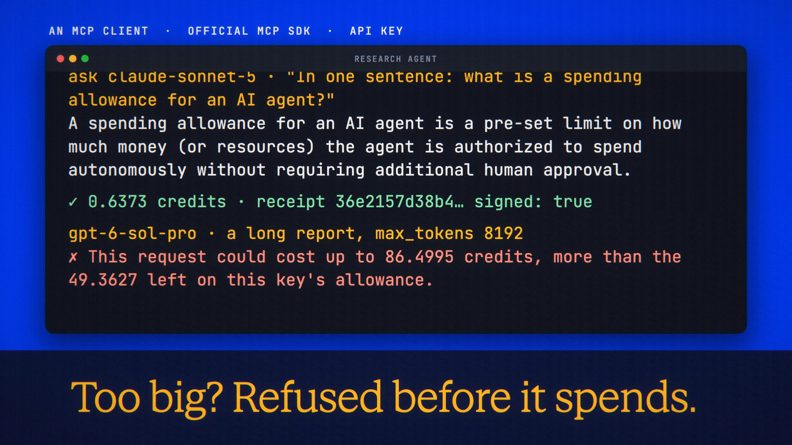

# Agent Allowances is live

**Hosted feature release · September 25, 2026**

Give an agent a key, not your wallet.

API keys can now carry an allowance: an agent name, a lifetime credit budget, an
expiry date and a pause switch, set per key in Account → API keys. Each key shows
what it has spent and what is left. A request that could cost more than what is
left is refused before anything is spent (`402 allowance_exhausted`), and a
paused key is refused (`403 key_paused`) until you resume it.

[Download the 16-second launch film](../assets/releases/agent-allowances.mp4)

## Notes

The allowance sits alongside a key's rolling 24-hour cap, and it applies to the
API and the MCP server alike.

## Video validation

A 16-second launch film cut around a real run on the released build: a key gets a
50-credit allowance and an expiry, a local MCP client (official MCP TypeScript
SDK) spends 0.6373 credits against it, a GPT-6 Sol Pro request with max_tokens
8192 is refused ("could cost up to 86.4995 credits, more than the 49.3627 left"),
and Pause stops the key. 1920×1080, 30 fps, H.264, no audio, metadata removed.

Docs and original artwork: CC BY-NC 4.0. Code: PolyForm Noncommercial 1.0.0.
See [LICENSE](../../LICENSE) and [NOTICE](../../NOTICE).
