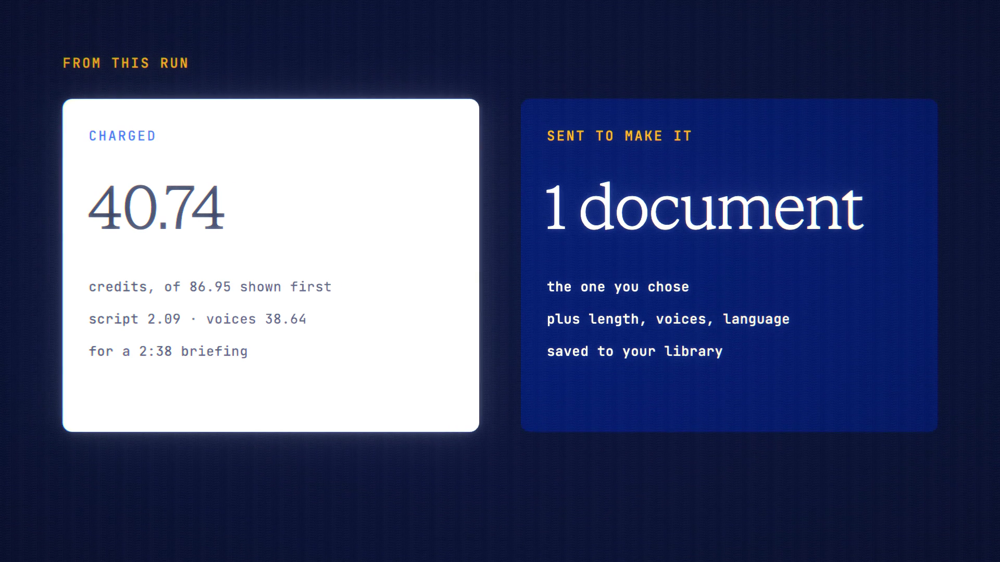

# Audio Overview is live

**Hosted feature release · September 2026**

Turn a document or a long chat into a short two-voice audio briefing.

Choose a source: an attached document, a saved chat or a Deep Research report.
Then pick a length (about 3 or 8 minutes), two voices and a language. The model
writes a two-host script from your source, each turn is voiced, and you get a
player with the transcript alongside and chapter jumps. The audio is saved to
your library, where erase and export already cover it.

- The maximum cost is shown before you start: the script, plus the voices per
  character at the models' prices.
- Each step is charged on what it actually used. If a step fails, nothing more
  is charged, and any audio already made is kept.
- **Off the record:** the audio isn't saved to your library; it plays and
  downloads in the session only.
- **Private Mode:** private models only.
- **Veil:** if Veil masked anything, Audio Overview declines, because the
  placeholders would be read aloud.

[Download the 24-second launch film](../assets/releases/audio-overview.mp4)

## Video validation

A 24-second launch film recorded on the Audio Overview build, on a local demo
account. The source was a one-page explainer on how passkeys work, written for
the film. The result was a 2:38 briefing in three chapters: Gemini 3.7 Flash
wrote the script, and DeepGram Aura 2 voiced it with amalthea and andromeda.

- **Cost:** the maximum shown first was 86.95 credits. The run charged 40.74
  credits: 2.09 for the script and 38.64 for the voices.
- **Sent:** only the chosen document, with the length, voices and language.

1920×1080, 30 fps, H.264, no audio, metadata removed.

Docs and original artwork: CC BY-NC 4.0. Code: PolyForm Noncommercial 1.0.0.
See [LICENSE](../../LICENSE) and [NOTICE](../../NOTICE).
