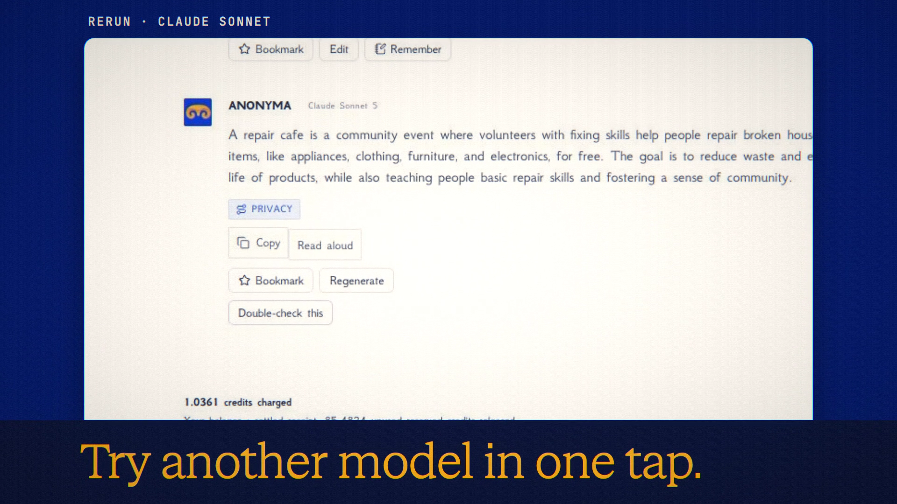

# Auto Model

**Code release · 27 September 2026 · hosted release live**

Auto chooses a model for each message and explains its choice below the reply.

[Public release commit](https://github.com/Anonyma-RH/Anonyma/commit/30668a3047df861d3b8d61afb5740306067bb6f0). The release code is published and deployed at [askanonyma.com](https://askanonyma.com). Production health, exact build revision and all ten feature flags were verified on 2026-09-27T20:16:08.130Z. Deployment used the locally verified application after the owner authorized manual deployment without GitHub Actions. The film remains local demonstration footage.

[Download the 19-second film](../assets/releases/auto-model.mp4)

## Demonstrated behavior

A short question routed to Gemini 3.7 Flash, with a quick-question explanation. The alternate-model control created a branch and a real Claude Sonnet 5 reply.

## Limits

When rules are uncertain, the optional small helper sees only the newest typed message, not attachments, memory or chat history. Privacy class and spending limits still apply.

## Media provenance

Edited real UI captures from a local batch 7 app, using synthetic inputs and real provider responses where applicable. Camera moves and titles are authored; the clip is not continuous realtime screen recording. No production customer data or fabricated product output. 1920×1080, 30 fps, H.264 with an original synthesized soundtrack.

Docs and original artwork: CC BY-NC 4.0. Code: PolyForm Noncommercial 1.0.0. See [LICENSE](../../LICENSE) and [NOTICE](../../NOTICE).
