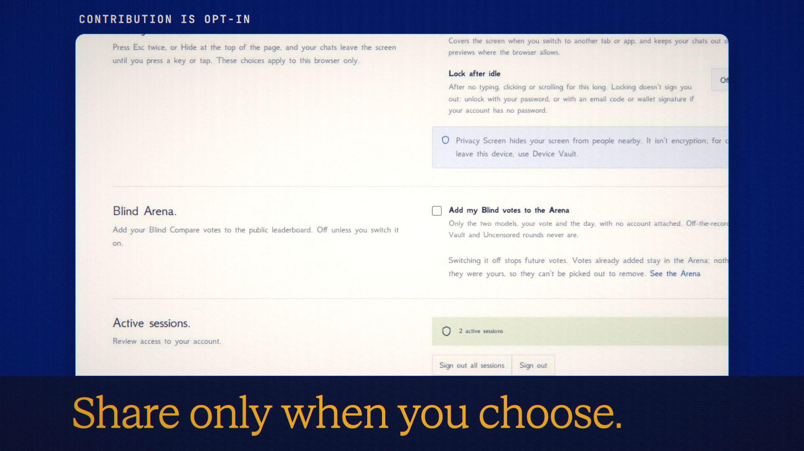

# Blind Arena

**Code release · 27 September 2026 · hosted release live**

An opt-in public leaderboard based on Blind Compare votes.

[Public release commit](https://github.com/Anonyma-RH/Anonyma/commit/62856968e14e3b9029bc9b1100289fe49d9d337d). The release code is published and deployed at [askanonyma.com](https://askanonyma.com). Production health, exact build revision and all ten feature flags were verified on 2026-09-27T20:16:08.130Z. Deployment used the locally verified application after the owner authorized manual deployment without GitHub Actions. The film remains local demonstration footage.

[Download the 19-second film](../assets/releases/blind-arena.mp4)

## Demonstrated behavior

The actual empty leaderboard, measurement explanation and opt-in control were captured. No synthetic rankings or votes were added.

## Limits

A model appears after 20 votes. Public votes contain the models, vote and day with no account attached. Previously contributed anonymous votes cannot be removed by account. Private, off-the-record, Device Vault and Uncensored rounds are excluded.

## Media provenance

Edited real UI captures from a local batch 7 app, using synthetic inputs and real provider responses where applicable. Camera moves and titles are authored; the clip is not continuous realtime screen recording. No production customer data or fabricated product output. 1920×1080, 30 fps, H.264 with an original synthesized soundtrack.

Docs and original artwork: CC BY-NC 4.0. Code: PolyForm Noncommercial 1.0.0. See [LICENSE](../../LICENSE) and [NOTICE](../../NOTICE).
