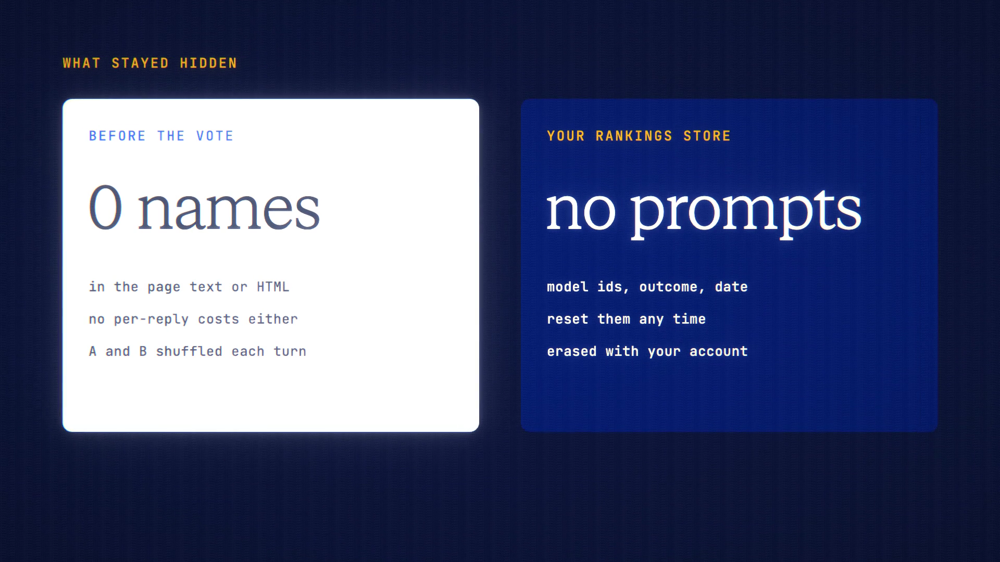

# Blind Compare is live

**Hosted feature release · September 2026**

Two models answer. Names hidden. You pick the better one, then we reveal who's
who.

Turn on **Blind**, pick two models or choose **Surprise me**, and ask once. The
replies appear side by side as A and B, in random order, with their names and
costs hidden. Vote A, B, Tie or Both bad. Then you see which model wrote each
reply, with its cost and speed. Continue with the winner, or keep comparing.

**Your rankings** shows each model's win rate from your own votes. It stores
only the model ids, the outcome and the date, never your prompts. You can reset
it, and it's included in erase and export.

- If one side fails, you're charged only for the other.
- Works with Veil, Off the record, Private Mode and Projects.

[Download the 23-second launch film](../assets/releases/blind-compare.mp4)

## Video validation

A 23-second launch film recorded on the release build, on a local demo account.
Claude Haiku 4.5 and GPT-5.4 Mini answered "Explain a zero-knowledge proof to a
12-year-old in three sentences." The vote went to B, which kept to three
sentences with no heading, and the reveal showed:

- **A:** Claude Haiku 4.5, 0.518 credits, 1.6 s.
- **B:** GPT-5.4 Mini, 0.359 credits, 1.4 s.

Before the vote, neither model's name nor either reply's cost appeared anywhere
in the page.

1920×1080, 30 fps, H.264, no audio, metadata removed.

Docs and original artwork: CC BY-NC 4.0. Code: PolyForm Noncommercial 1.0.0.
See [LICENSE](../../LICENSE) and [NOTICE](../../NOTICE).
