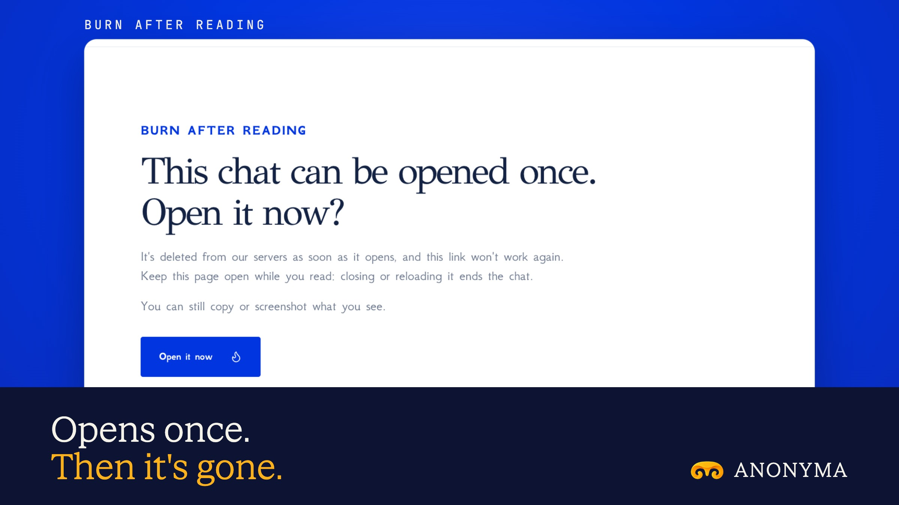

# Burn After Reading is live

**Hosted feature release · September 2026**

Share a chat that deletes itself after one read.

Burn After Reading is an option on Share a Chat and Sealed Share: the link opens
once, then the shared copy is deleted.

- Opening the link shows a page asking whether to open it now. Only that click
  opens and burns it, so link previews in X, Telegram, iMessage or Slack, and
  browsers that prefetch links, can't use it up.
- Opening happens in one step on the server: the first reader gets the chat, and
  the stored copy (or, for a sealed link, the ciphertext) is deleted right away.
  Anyone after that sees the same page as for a revoked or unknown link.
- Only a hash of the link's secret is stored, so the address is shown once.
- Your share list shows "not opened yet" or the date it was opened. You can still
  revoke it, and the link's normal expiry still applies.

The reader can still copy or screenshot what they see.

## Image validation

A launch image made from the release build now in production, on a local demo
server, with a made-up chat.

- Thirteen plain fetches of the link (including the user agents link previews
  use) left it unopened. The API only said it was a burn link.
- One click opened it, and the stored copy was deleted at once. A reload, a second
  open and a made-up link all showed the same "already opened, or isn't
  available" page.
- The server keeps the link's dates, not its content.

2400×1350 JPEG.

Docs and original artwork: CC BY-NC 4.0. Code: PolyForm Noncommercial 1.0.0.
See [LICENSE](../../LICENSE) and [NOTICE](../../NOTICE).
