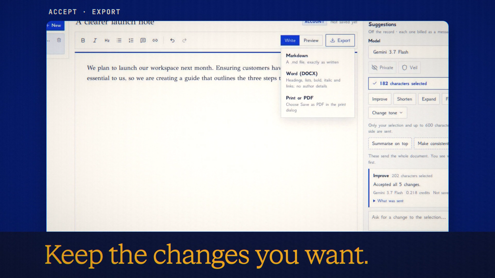

# Canvas

**Code release · 27 September 2026 · hosted deployment pending CI**

Edit a document alongside AI and review suggestions as tracked changes.

[Public release commit](https://github.com/Anonyma-RH/Anonyma/commit/3d106bd07794d8477f42083786192260c65af68b). The release code is published. The hosted rollout is pending GitHub Actions billing recovery; do not treat the local footage as proof that the hosted feature is live.

[Download the 19-second film](../assets/releases/canvas.mp4)

## Demonstrated behavior

A synthetic prose draft received a real model edit, which preserved paragraph form. The changes were reviewed and accepted; the export menu was inspected.

## Limits

Selection edits send the selection and limited nearby context; broader actions can send broader document content. Exports are Markdown, DOCX and PDF. Footage predates the final provider-usage normalization; no displayed cost is used as a pricing promise.

## Media provenance

Edited real UI captures from a local batch 7 app, using synthetic inputs and real provider responses where applicable. Camera moves and titles are authored; the clip is not continuous realtime screen recording. No production customer data or fabricated product output. 1920×1080, 30 fps, H.264 with an original synthesized soundtrack.

Docs and original artwork: CC BY-NC 4.0. Code: PolyForm Noncommercial 1.0.0. See [LICENSE](../../LICENSE) and [NOTICE](../../NOTICE).
