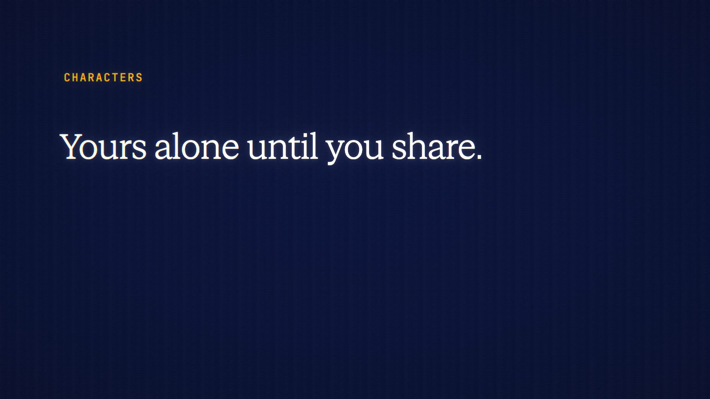

# Characters is live

**Hosted feature release · September 2026**

Make your own AI characters.

Give a character a name, a short description, a personality (its instructions),
an opening message, a default model (uncensored models included) and an avatar,
then chat with it.

- The instructions go in the way a project's instructions do, after your own
  standing and project instructions. Veil masks them like any other prompt text,
  and they're never saved inside a chat.
- The opening message is shown as the character's first turn and costs nothing.
- Avatars are cleaned of hidden details and resized to 256 px in your browser.
- Characters are private. "Share a copy" makes a link another signed-in person
  can use to import a copy after seeing its full instructions. The link carries
  no chats, can be revoked, and expires after 30 days by default. Seed Guard
  checks instructions on save and import.
- In Private Mode only private models are offered. Off the record, the chat
  isn't saved, but the character is.

[Download the 22-second launch film](../assets/releases/characters.mp4)

## Video validation

A 22-second launch film recorded on the release build now in production, on a
local demo server, with a made-up tutor character, "Socrates", on Gemini 3.7
Flash.

- The opening message appeared at no charge; the reply cost 0.79 credits with
  Veil on.
- The instructions went in one system message and weren't saved with the chat.
  With Veil on, an email address in the instructions was sent as `[EMAIL_1]`.
- The share link needs a signed-in reader, carries only the character (no
  chats and no owner), and lasted 30 days by default. It's masked in the film.

1920×1080, 30 fps, H.264, no audio, metadata removed.

Docs and original artwork: CC BY-NC 4.0. Code: PolyForm Noncommercial 1.0.0.
See [LICENSE](../../LICENSE) and [NOTICE](../../NOTICE).
