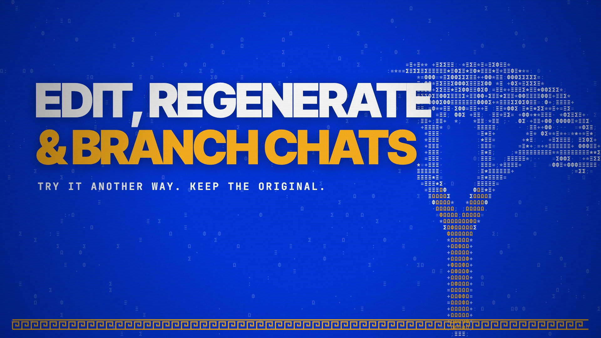

# Edit, Regenerate & Branch Chats

Edit an earlier prompt or regenerate an answer in a new branch. The original conversation keeps its messages. Open a saved chat to branch from a specific message, follow the link back to its original, or open its other branches.

Repeated clicks are guarded so one action starts one branch and resend. Copied messages cost nothing; requesting a new answer uses the normal quoted model rates and billing rules. A regenerated answer uses its original model when still available, otherwise the selected model.

Branches of shared conversations stay in the same Collab and follow its membership permissions. Auto-delete deadlines are preserved. Off-the-record chats rewind only in the current browser session and remain unsaved. Symposium runs cannot be branched.

[Download the 20-second film](../assets/releases/chat-branches.mp4)

The film uses illustrated sample chats and original animated ASCII olive trees and laurels on website blue. 1920×1080, 30 fps, H.264/AAC.

Code: PolyForm Noncommercial 1.0.0. Docs and original artwork: CC BY-NC 4.0. See [LICENSE](../../LICENSE) and [NOTICE](../../NOTICE).
