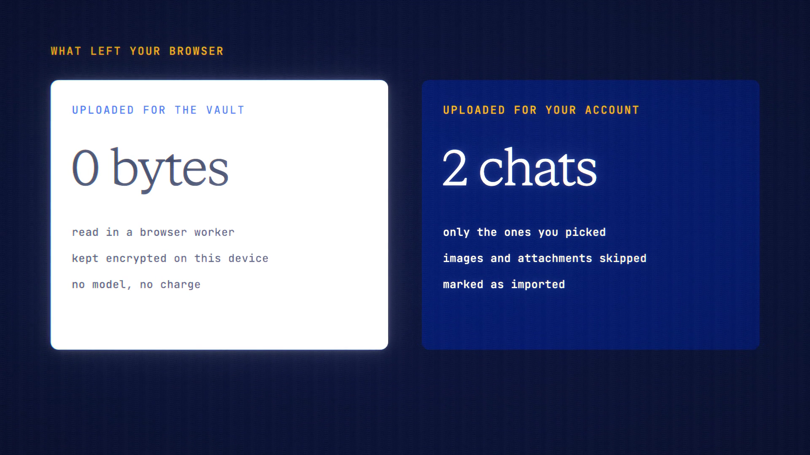

# Chat Import is live

**Hosted feature release · September 2026**

Bring your ChatGPT or Claude history with you.

Chat Import reads the official export from ChatGPT (the ZIP) or Claude
(conversations.json) in your browser. No model is called, so it's free.

- You see every conversation with its title, date and message count, and pick
  the ones to keep.
- Keep them in your Device Vault (recommended: encrypted, on this device), in
  your account (only the chats you pick are uploaded, marked as imported), or as
  Markdown files (nothing is saved).
- Nothing is uploaded unless you choose your account.
- Attachments, images and hidden reasoning are skipped, and counted so you know.
- Seed Guard checks each chat. When saving to your account, a chat it flags is
  skipped unless you allow it.

[Download the 23-second launch film](../assets/releases/chat-import.mp4)

## Video validation

A 23-second launch film recorded on the release build now in production, on a
local demo server, with a made-up ChatGPT export (8 chats, one image) and a
made-up Claude file.

- Every request from the page and its worker was recorded. Reading the export
  and keeping chats in the Device Vault or as Markdown sent no chat text at all.
- Saving to the account uploaded only the 2 chats that were picked (2,140 bytes).
- The image was counted and left out. No model was used and nothing was charged.
- Imported chats show a banner saying they were imported and that the replies
  were written by the other service.

1920×1080, 30 fps, H.264, no audio, metadata removed.

Docs and original artwork: CC BY-NC 4.0. Code: PolyForm Noncommercial 1.0.0.
See [LICENSE](../../LICENSE) and [NOTICE](../../NOTICE).
