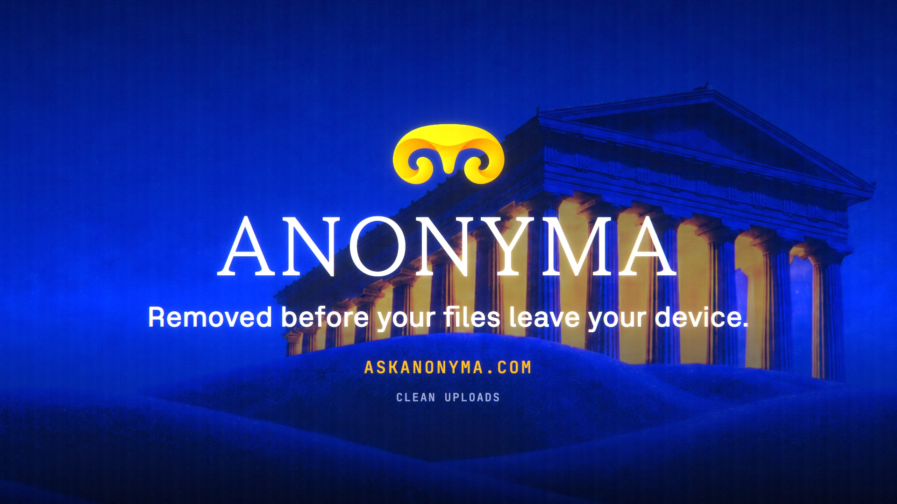

# Clean Uploads is live

**Hosted feature release · September 2026**

Location, camera and author details are removed in your browser before your
files leave your device.

Photos (JPEG, PNG, WebP, GIF, and HEIC where the browser can decode it), saved
Word, Excel and PowerPoint uploads, and saved MP3, WAV, FLAC and M4A audio lose
the details they carry about you: GPS location, camera make, model and serial
number, author names, dates, the software used and edit history. This happens on
your device, so neither the AI provider nor ANONYMA receives them.

Each file shows a short line, such as "Removed: location, camera details,
author, dates, comments", with a **Keep original** option. PDF and Office files
attached to a chat never leave the device (only their text is sent), so their
line tells you what stays behind instead.

[Download the 14-second launch film](../assets/releases/clean-uploads.mp4)

## Notes

- Image data is copied unchanged. A photo whose metadata says to rotate it is
  redrawn the right way up instead, since that rotation lives in the metadata.
- **Keep original** sends the file exactly as it is.
- OGG and WebM audio can't be cleaned; ANONYMA asks what you want to do.
- What is visible in the picture itself stays. A model can still guess a place
  from what it sees.

## Video validation

A 14-second launch film recorded on the Clean Uploads build. The demo photo was
made for the film with fake metadata: GPS near the Acropolis in Athens, camera
"Anonyma Demo Camera", author "Maya Reyes", and a date. The chip listed what was
removed. The image that left the browser was checked and carried no EXIF block
at all: no location, no camera and no author (231,269 bytes before, 231,001
after). Asked where the photo was taken, Gemini 3.7 Flash guessed from the
picture alone: the Temple of Artemis at Ephesus, in Turkey. 1920×1080, 30 fps,
H.264, no audio, metadata removed.

Docs and original artwork: CC BY-NC 4.0. Code: PolyForm Noncommercial 1.0.0.
See [LICENSE](../../LICENSE) and [NOTICE](../../NOTICE).
