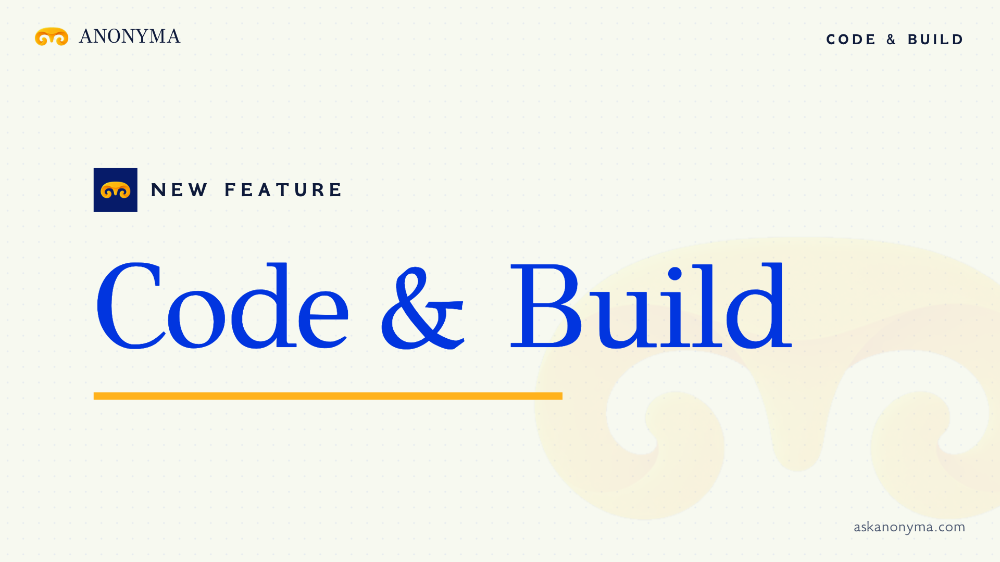

# Code & Build is live

**Hosted feature release · September 24, 2026**

An idea. A prompt. A project.

[Open Code & Build](https://askanonyma.com/workspace/code).

This release enables the Code workspace on the hosted app. Generate code with
one of the available chat models, inspect the generated files beside the
conversation, and download the project as a ZIP. Model selection remains the
MVP lineup; the other feature releases keep their own gates.

[Download the 14-second launch film](../assets/releases/code-and-build.mp4)

## Activation

The Code & Build entry in `server/releases.js` now has `released: true`.
That commit enables only this feature even when the hosted release setting is
`mvp`. No other feature is activated by this release.

## Run locally

Follow the [local setup](../../README.md#run-locally). Set
`RELEASED_FEATURES=mvp` in your local `.env` to reproduce the MVP plus this
committed Code release. Local test mode uses simulated responses; real model
generation requires your own provider access.

## Limitations

Generated files are not executed in a sandbox by this workspace. Review and test
generated code before running it. ZIP export packages the generated files and
does not verify that a project builds successfully. The rest of the planned
feature releases remain gated on the hosted app.

## Video validation

The launch film is 1920×1080, 30 fps, H.264 with stereo AAC audio. Keyframe text
and a 42-frame sweep were checked with Tesseract. The film uses the feature name
and a “Live now” end card for this hosted release.

Docs and original artwork: CC BY-NC 4.0. Code: PolyForm Noncommercial 1.0.0.
See [LICENSE](../../LICENSE) and [NOTICE](../../NOTICE).
