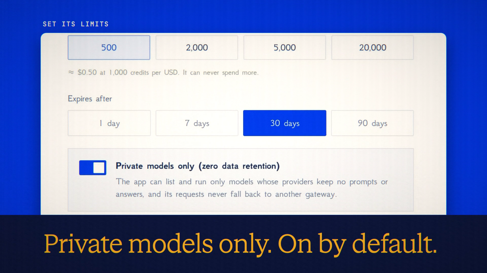

# Connect an App is live

**Hosted feature release · September 25, 2026**

Give your agent a budget, not your card.

Point an MCP app that supports sign-in (OAuth) at askanonyma.com/mcp. It opens
ANONYMA, where you set what it gets: a budget in credits, an expiry (30 days
unless you change it) and private models only (zero data retention), on by
default. Approve, and the app connects without an API key.

Each connection is listed under Account → API keys → Connected apps with what it
has spent, its activity (time, model, credits and receipt id; no prompts or
answers) and Pause and Revoke. It never gets your email, username, chats or
balance, and it can never spend more than its budget.

[Download the 30-second launch film](../assets/releases/connect-an-app.mp4)

## Notes

One-click connect is verified end to end with the official MCP TypeScript SDK:
discovery, registration, PKCE, consent, token, tool calls and refresh. Apps
choose their own names, and the consent page says so. A paused or used-up
connection gets a plain refusal; a revoked or expired one has to connect again.

## Video validation

A 30-second launch film cut around a real run on the released build: a local MCP
app built on the official MCP TypeScript SDK connects and is approved with a
500-credit budget, gets an answer from DeepSeek V4.1 Flash (a private model)
with a signed receipt, is refused GPT-6 Sol under the private-only default, and
is then paused and revoked from Account. The terminal lines are that app's
actual output. 1920×1080, 30 fps, H.264, no audio, metadata removed.

Docs and original artwork: CC BY-NC 4.0. Code: PolyForm Noncommercial 1.0.0.
See [LICENSE](../../LICENSE) and [NOTICE](../../NOTICE).
