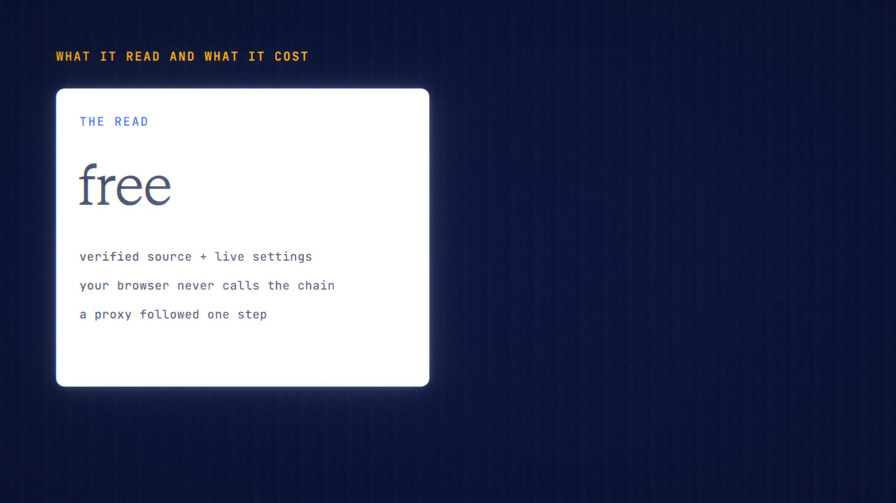

# Contract Reader is live

**Hosted feature release · September 2026**

See who controls a token or contract, and what they can do.

Paste a contract address (or an explorer link) and pick the chain: Robinhood
Chain, Ethereum, Base, Arbitrum or OP.

- ANONYMA's server reads the verified source code (from Sourcify or the chain's
  explorer), follows a proxy one step to its implementation, and reads live
  settings such as the owner, admin roles, pause state and supply from public
  nodes. These lookups are free.
- A model then explains it in plain English: who controls it, what each of them
  can do (with the function and the file and line, which you can click to see
  the code), things to check, and what this can't tell you. The code is sent as
  data, and the price is shown first.
- For unverified contracts it says so, and lists which common functions the
  bytecode exposes.

Not an audit, not financial advice. It reads the code; it can't promise what
people will do.

[Download the 24-second launch film](../assets/releases/contract-reader.mp4)

## Video validation

A 24-second launch film recorded on the release build now in production, on a
local demo server, reading USDG on Robinhood Chain (the page's own example).

- Reading the contract was free. The browser contacted only ANONYMA; the server
  read the source and live settings.
- GLM 5.2 Fast's explanation was quoted at up to 162 credits and cost 14.32.
  The source was sent as data, not in the browser's request.
- Each power in the answer links to its file and line, and the page shows "Not
  an audit, not financial advice."

1920×1080, 30 fps, H.264, no audio, metadata removed.

Docs and original artwork: CC BY-NC 4.0. Code: PolyForm Noncommercial 1.0.0.
See [LICENSE](../../LICENSE) and [NOTICE](../../NOTICE).
