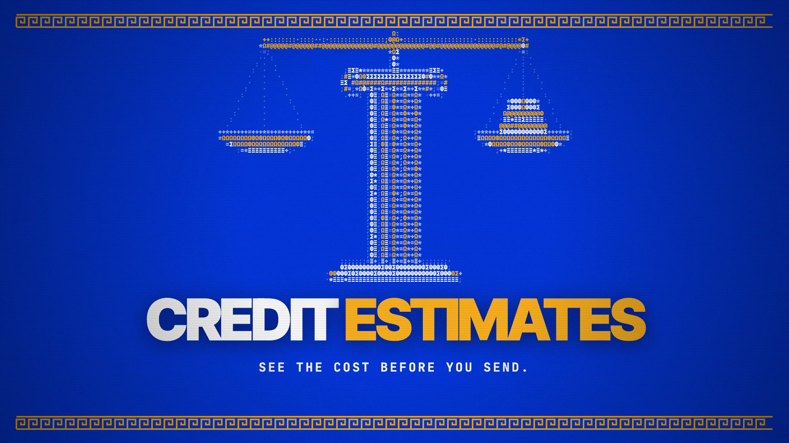

# Credit Estimates

See estimated credits beside Send in Chat, Code & Build and Uncensored Models. The estimate updates after a pause in typing, and follows the selected model, Web option, documents and images.

The chip is explicitly an estimate. It prices the request and a 4,096-token reply budget; actual charges and temporary reservations can differ. Updating estimates and failures are shown clearly instead of displaying an old number or a false zero.

With Veil enabled, estimates use the same masked request as Send. Quoting goes to Anonyma's server, not a model provider, and does not reserve or charge credits.

[Download the 20-second film](../assets/releases/credit-estimates.mp4)

The film uses illustrated sample prompts and estimates, original animated Greek ASCII art, and music. 1920×1080, 30 fps, H.264/AAC. Media studios retain their explicit quote flows.

Code: PolyForm Noncommercial 1.0.0. Docs and original artwork: CC BY-NC 4.0. See [LICENSE](../../LICENSE) and [NOTICE](../../NOTICE).
