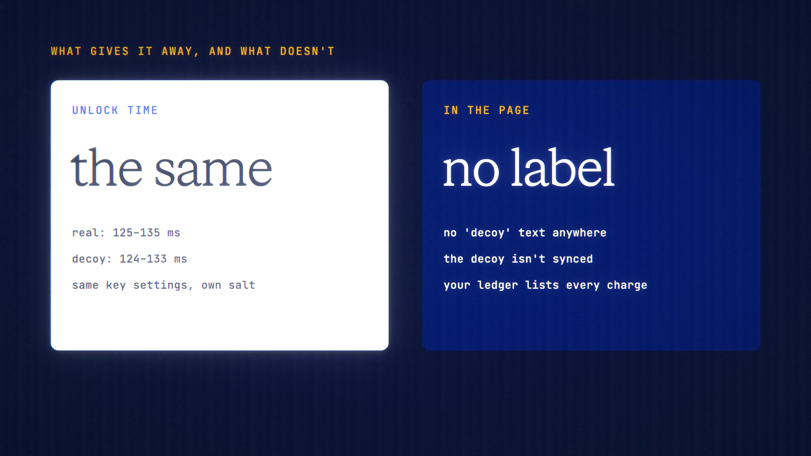

# Decoy Vault is live

**Hosted feature release · September 2026**

If someone makes you unlock your vault, use the other passphrase.

Decoy Vault lets you set a second passphrase for your Device Vault. Unlocking
with it opens a separate, harmless decoy vault instead of your real chats. It
starts with four ordinary sample chats that you can edit.

- Either passphrase unlocks with the same look and in the same time: both keys
  are derived on every unlock, and nothing marks the decoy while it's open.
- The decoy isn't synced. Vault Sync covers only your real vault, and shows as
  off while the decoy is open, so with sync on the two vaults don't look quite
  the same.
- Setting, changing or removing a decoy needs the open vault's passphrase.
  Panic Wipe and "Forgot it?" remove both vaults.

Its limits, stated in settings:

- Someone examining your browser's storage could tell that two vaults exist.
- Your account's ledger still lists the charge for each message, from either
  vault.
- It's a deterrent against casual pressure, not proof against an expert.

[Download the 23-second launch film](../assets/releases/decoy-vault.mp4)

## Video validation

A 23-second launch film recorded on the release build now in production, on a
local demo server, with made-up passphrases (only dots appear on screen).

- Both vaults use the same key settings (PBKDF2, 600,000 iterations), each with
  its own random salt. Over four rounds the real vault unlocked in 125–135 ms,
  the decoy in 124–133 ms, and a wrong passphrase was rejected in 117–138 ms.
- No "decoy" text or attribute appeared in the page with either vault open.
- The decoy wasn't synced: the server's synced copy held only the real chats.
- The account ledger kept the charges for the real chats.

1920×1080, 30 fps, H.264, no audio, metadata removed.

Docs and original artwork: CC BY-NC 4.0. Code: PolyForm Noncommercial 1.0.0.
See [LICENSE](../../LICENSE) and [NOTICE](../../NOTICE).
