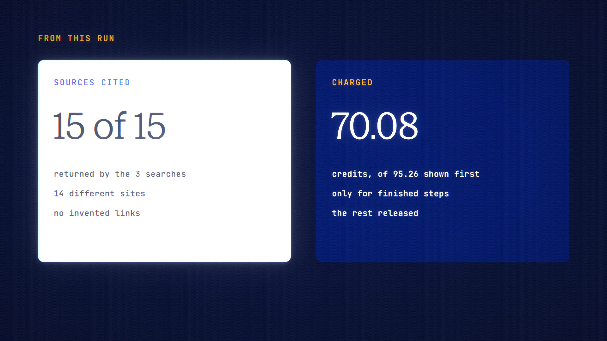

# Deep Research is live

**Hosted feature release · September 2026**

Ask a hard question. Get a sourced report.

Turn on **Deep research** in the composer and pick a depth: Quick runs 3 web
searches, Thorough runs 6. Before you send, it shows the most the run can cost:
the plan, each search (web fee included) and the report, at your model's prices.
Then:

1. The model plans a few focused sub-questions.
2. Each one gets its own web search.
3. The model writes a report with numbered citations.

Every citation points to a page one of those searches actually returned.
Invented links are removed.

- Each step is reserved and settled on its own. You pay for finished steps
  only, and Stop cancels the rest.
- The report is saved as a normal reply, with its sources, so History,
  Bookmarks, Export and Share work.
- If Veil masked anything in your question, Deep research declines rather than
  search with placeholders. Seed Guard checks the question too.

[Download the 23-second launch film](../assets/releases/deep-research.mp4)

## Video validation

A 23-second launch film recorded on the release build, on a local demo account.
It's a real Quick run on Gemini 2.5 Flash: "How do passkeys stop phishing,
compared with passwords and SMS codes?"

- **Cost:** the maximum shown before sending was 95.26 credits, and the run
  charged 70.08 credits (about 7¢). The rest of the reserve was released.
- **Sources:** the report cited 15 sources from 14 sites, and all 15 were
  returned by the three searches.

1920×1080, 30 fps, H.264, no audio, metadata removed.

Docs and original artwork: CC BY-NC 4.0. Code: PolyForm Noncommercial 1.0.0.
See [LICENSE](../../LICENSE) and [NOTICE](../../NOTICE).
