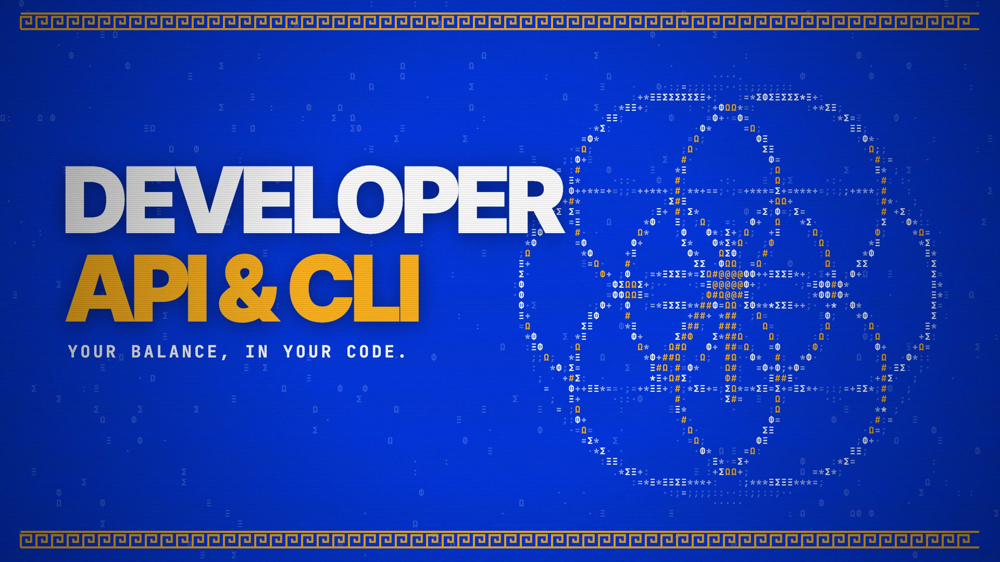

# Developer API & CLI

**Hosted feature release · September 25, 2026**

Use an API key for OpenAI-compatible chat completions and model discovery, or send requests from the terminal CLI. Optional per-key caps apply over a rolling 24 hours.

[Open Developer API & CLI](https://askanonyma.com/docs/api)

[Download the launch film](../assets/releases/developer-api-and-cli.mp4)

## What ships and limitations

Compatibility covers the documented chat-completions, model-list and balance routes; it does not imply every OpenAI endpoint or option is supported. Keep API keys secret. Requests use prepaid credits and remain subject to model availability and rate limits.

## Film

The film uses an original animated Greek ASCII drafting compass, rosette and scroll. The API key is masked, model identifiers are placeholders, and replies and balances are labeled samples.

The 20-second 1920×1080, 30 fps H.264/AAC export passed full decode, audio headroom, text-recognition and visual checks on SHA-256 2722f3b5a6865959ce208163d5487a403c87b5c317adde764129f44921c3dcc2.

## X draft

Your balance, in your code.

ANONYMA Developer API & CLI is live.

OpenAI-compatible chat completions and models, a terminal CLI, and optional rolling 24-hour credit caps per key.

https://askanonyma.com

Docs and original artwork: CC BY-NC 4.0. Code: PolyForm Noncommercial 1.0.0. See [LICENSE](../../LICENSE) and [NOTICE](../../NOTICE).
