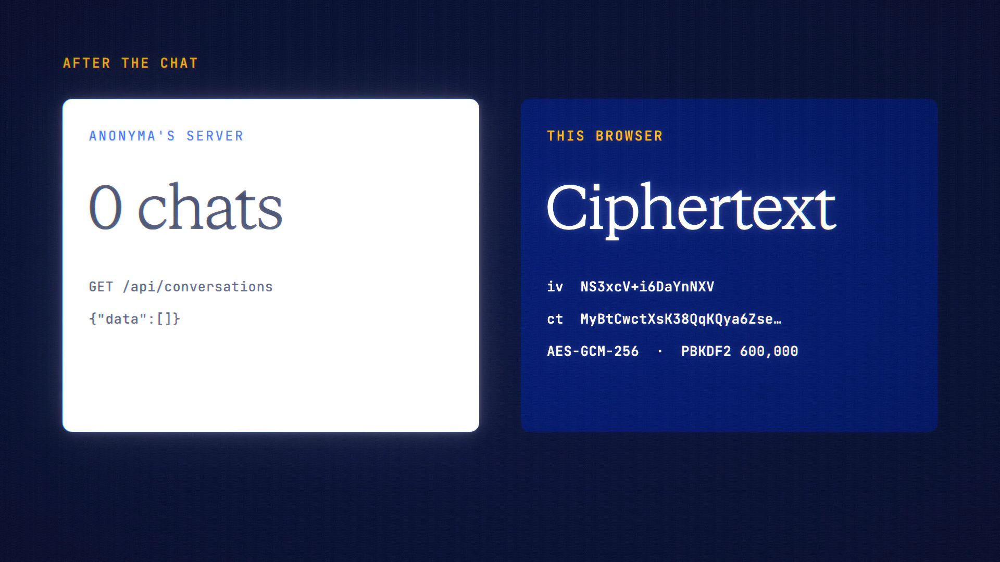

# Device Vault is live

**Hosted feature release · September 2026**

Your chats, only on your device.

**Device only** is a third choice beside a saved chat and Off the record. The
chat is sent exactly like an off-the-record one, so ANONYMA's servers store
none of it. Your browser keeps it instead, encrypted with a key made from your
vault passphrase: PBKDF2-SHA256 with 600,000 iterations, then AES-256-GCM with
a random IV for each record. Only a salt and a verifier are stored with it; the
key lives in memory.

- The sidebar lists your Device Vault chats while the vault is unlocked.
- The vault locks when you press Lock, after an idle time you choose (15
  minutes by default), when the tab closes or reloads, and when the account
  changes.
- Export the encrypted vault and import it on another device.
- Veil's masked words are kept inside the vault too.

[Download the 24-second launch film](../assets/releases/device-vault.mp4)

## Notes

- Lose the passphrase and these chats are gone; ANONYMA can't recover them.
- Anyone using this browser while the vault is unlocked can read them.
- The model provider still receives what you send.

## Video validation

A 24-second launch film recorded in one take on the Device Vault build, on a
local demo account with a throwaway passphrase. It shows setting up the vault;
a real Claude Haiku 4.5 chat with Device only on; the reload that locks it; a
wrong passphrase refused ("That passphrase doesn't open this vault."); and the
chat back after unlocking. Afterwards the server listed no conversations, and
the browser's vault held one encrypted chat record, with the prompt text found
nowhere in plain form in IndexedDB, localStorage or sessionStorage. The values
on the film's proof card are from that run. 1920×1080, 30 fps, H.264, no audio,
metadata removed.

Docs and original artwork: CC BY-NC 4.0. Code: PolyForm Noncommercial 1.0.0.
See [LICENSE](../../LICENSE) and [NOTICE](../../NOTICE).
