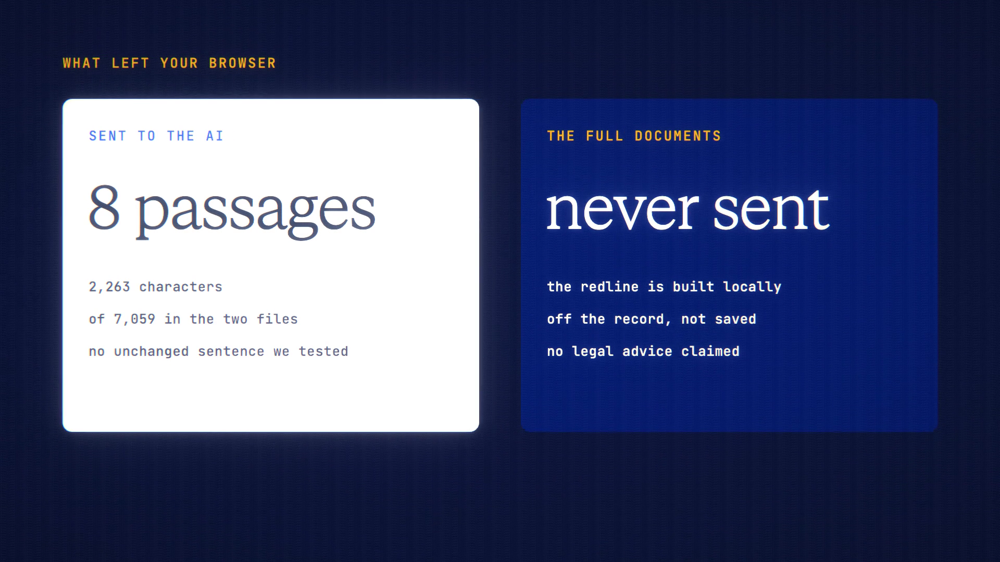

# Document Compare is live

**Hosted feature release · September 2026**

Drop two versions of a document, such as a contract, to see every change and ask
what matters. Only the changed parts go to the AI.

Open **Compare docs** and drop in an Original and a Revised version. It accepts
PDF, Word, text and Markdown, and the text is read in your browser. You get:

- a word-level redline, like tracked changes;
- a change list with counts;
- next and previous buttons;
- **Hide unchanged**;
- exports of the redline as HTML and the change list as Markdown.

**AI summary** is the only model call. It sends only the changed passages, with a
little context, never the full documents. "What the AI sees" shows the exact text
first. The reply covers what changed, what might matter and what to check with a
professional. It bills as a normal message, off the record, and Veil masks the
passages.

It isn't legal advice.

[Download the 23-second launch film](../assets/releases/document-compare.mp4)

## Video validation

A 23-second launch film recorded on the Document Compare build, on a local demo
account, with two fake NDAs between invented companies containing 8 changes.
Claude Haiku 4.5 summarised the changes for 5.42 credits.

- The one request sent carried only the 8 changed passages: 2,263 characters,
  out of 7,059 in the two files.
- None of the unchanged sentences we checked appeared in any request.

1920×1080, 30 fps, H.264, no audio, metadata removed.

Docs and original artwork: CC BY-NC 4.0. Code: PolyForm Noncommercial 1.0.0.
See [LICENSE](../../LICENSE) and [NOTICE](../../NOTICE).
