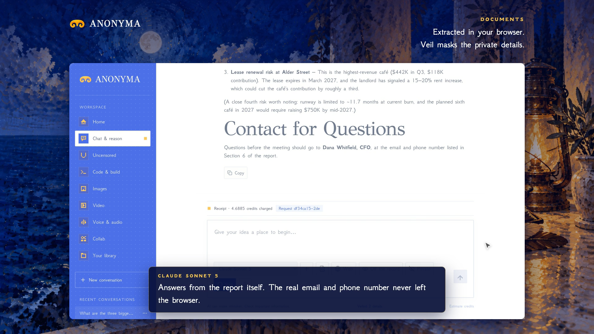

# Documents is live

**Hosted feature release · September 25, 2026**

Bring the document. Ask the question.

Attach PDF, text, CSV and code files to any message in Chat, Code & Build or
Uncensored. The text is extracted in your browser and sent with your prompt,
and the conversation keeps a tidy document chip instead of a wall of pasted
text.

Documents work with Veil and Private Mode: private details inside an attached
file are masked in the browser like the rest of the message.

[Download the 34-second launch film](../assets/releases/documents.mp4)

## Limits

Up to 5 documents per message and 25 MB per file. Large documents are trimmed
to fit the server's 48,000-character message limit, and the notice shows how
much was sent. Scanned PDFs without a text layer have no text to extract.

## Video validation

A screen recording of the released feature: a three-page PDF attached with
Veil on, answered by Claude Sonnet 5. The model received the CFO's contact
details only as [EMAIL_1] and [PHONE_1]. 1920×1080, 30 fps, H.264, no audio,
metadata removed.

Docs and original artwork: CC BY-NC 4.0. Code: PolyForm Noncommercial 1.0.0.
See [LICENSE](../../LICENSE) and [NOTICE](../../NOTICE).
