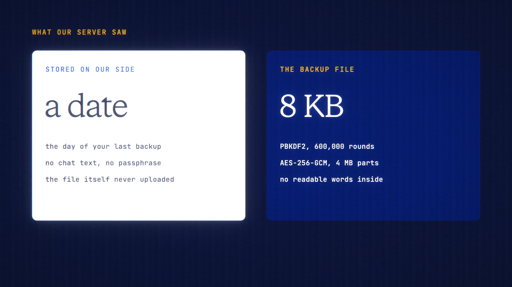

# Encrypted Backup is live

**Hosted feature release · September 2026**

Take everything with you in one file.

Make a backup in your account settings (Encrypted backup): your saved conversations, projects, scrolls,
bookmarks, memory, characters, saved subtitles, and routine and watch settings, in one
`.anonyma-backup` file.

- It's encrypted in your browser with a passphrase only you know (PBKDF2 with
  600,000 rounds and AES-256-GCM, in 4 MB parts). ANONYMA's server never sees
  the passphrase or a readable backup. It only records the date of your last
  backup.
- Restore it into any ANONYMA account: see what's inside, choose what to bring
  back, and it's added alongside what's there. Nothing is replaced, duplicates
  are skipped, and restored chats keep their modes and bookmarks.
- Files and media aren't included.

Lose the passphrase and the backup can't be opened, by you or by us.

[Download the 23-second launch film](../assets/releases/encrypted-backup.mp4)

## Video validation

A 23-second launch film recorded on the release build now in production, on a
local demo server, with four made-up chats, a project and a bookmark. The
passphrase fields are masked.

- Making the backup sent no chat text or passphrase. The server recorded only the
  date. The 8 KB file held a small header and ciphertext, with no readable words.
- Restoring into a second account uploaded only the chosen items. Chats came back
  marked "Restored", and the bookmark came back on the same reply.
- Restoring is chosen by kind (chats, projects, bookmarks and so on).

1920×1080, 30 fps, H.264, no audio, metadata removed.

Docs and original artwork: CC BY-NC 4.0. Code: PolyForm Noncommercial 1.0.0.
See [LICENSE](../../LICENSE) and [NOTICE](../../NOTICE).
