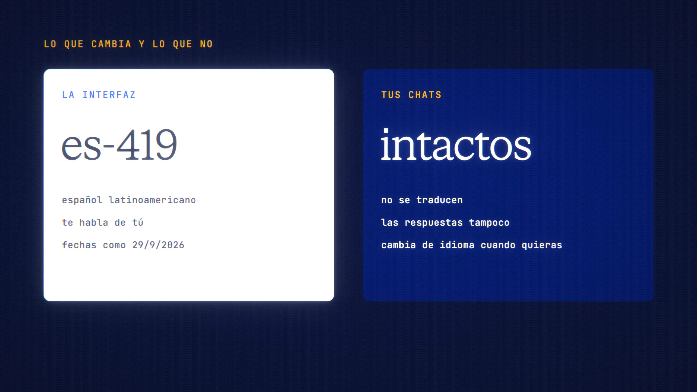

# Español is live

**Hosted feature release · September 2026**

ANONYMA, ahora en español.

The whole site, the workspace and your account are now available in Spanish:
neutral Latin American Spanish, addressing you as tú. Switch between EN, ES
and 中文 in the header or in your account.

- Your chats and the models' replies stay exactly as written. They aren't
  translated.
- Dates follow the Spanish format (day/month/year), and the page language is
  set to es-419.
- A few things are still in English for now: the headings Meeting Notes
  generates, the Fact-check verdict title, the text inside the home page's demo
  video, and some release names on the pricing page.

Todo el sitio, el espacio de trabajo y tu cuenta, en español. Tus chats y las
respuestas de los modelos se quedan tal como están.

[Download the 23-second launch film](../assets/releases/espanol.mp4)

## Video validation

A 23-second launch film recorded on the release build now in production, on a
local demo server.

- Switching to ES set the page language to es-419, and dates read like
  29/9/2026.
- An English chat and its reply stayed exactly as written while the interface
  around them turned Spanish.
- A few things were still in English at release and are being fixed: the text
  inside the home page's demo video, some release names on the pricing page and
  an account badge. The film doesn't show them.

1920×1080, 30 fps, H.264, no audio, metadata removed.

Docs and original artwork: CC BY-NC 4.0. Code: PolyForm Noncommercial 1.0.0.
See [LICENSE](../../LICENSE) and [NOTICE](../../NOTICE).
