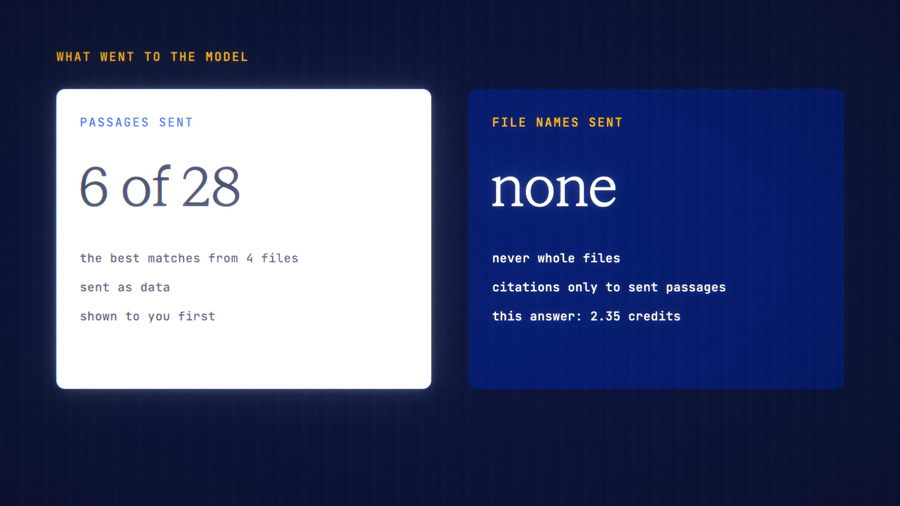

# File Search is live

**Hosted feature release · September 2026**

Ask across all your files at once.

File Search answers one question from all your saved documents, or from one
project's pinned files.

- It finds the passages most likely to answer, and only the top 6 go to the
  model, as data and without file names. Whole files are never sent.
- "What the AI sees" shows those passages before you send.
- The answer cites numbered passages, and each citation opens the file at that
  passage. Citations only point to passages that were sent.
- An unusable answer costs nothing.
- Private Mode uses zero-data-retention models only; off the record keeps
  nothing.

[Download the 23-second launch film](../assets/releases/file-search.mp4)

## Video validation

A 23-second launch film recorded on the release build now in production, on a
local demo server, with four made-up documents saved as Files.

- Of 28 passages in the four files, only the top 6 went to Claude Sonnet 5.5, as
  data. The request held only the question and those passages: 3,472 characters
  of the files' 7,092, and no file names.
- The "What the AI sees" panel showed exactly the text the model received.
- Every citation in the answer pointed to a passage that was sent. The answer
  cost 2.35 credits against an 88.18-credit hold.
- The search matches words, not meaning, as the page says.

1920×1080, 30 fps, H.264, no audio, metadata removed.

Docs and original artwork: CC BY-NC 4.0. Code: PolyForm Noncommercial 1.0.0.
See [LICENSE](../../LICENSE) and [NOTICE](../../NOTICE).
