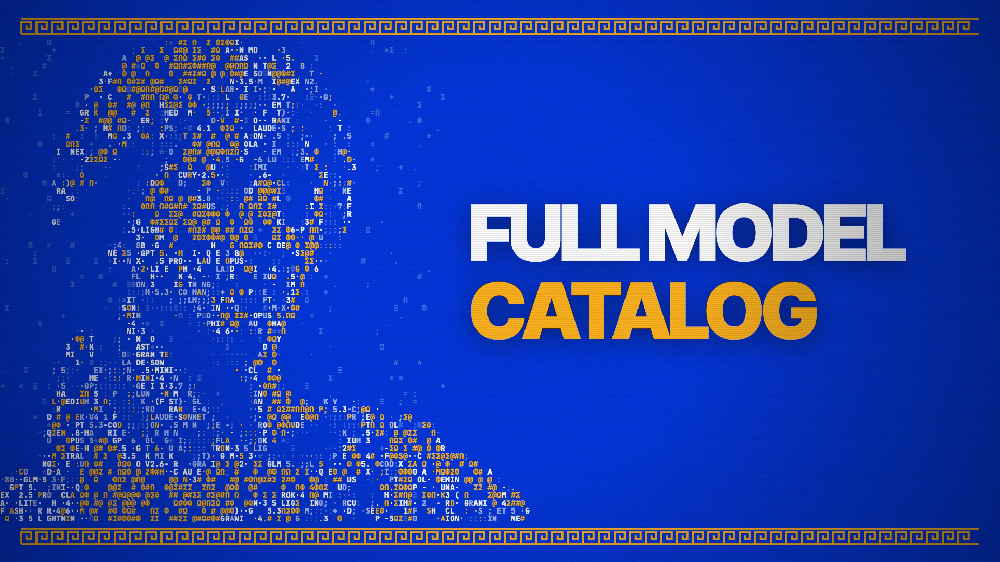

# Full Model Catalog

**Hosted feature release · September 25, 2026**

More models. One balance. The expanded chat catalog is available in [Anonyma](https://askanonyma.com/workspace/chat). Search the model picker and switch models inside a conversation with @mentions. Usage draws from the same prepaid balance.

[Download the Greek ASCII launch film](../assets/releases/full-model-catalog.mp4)

## What ships

The catalog release removes the launch shortlist restriction for chat models. Model prices, availability and capabilities come from the gateway catalog and can change. Image, audio and video tools retain their independent release gates. Private Mode continues to narrow selection to eligible private models.

## Film and limitations

The 20.4-second film uses original animated Greek ASCII artwork on Anonyma blue. Search and prompt scenes are labeled illustrations, not recordings of provider responses. The export is 1920×1080 at 30 fps with H.264 video and AAC audio. Full-file decode, text recognition, audio checks and visual review passed on SHA-256 2899eeeb372eb996764cb633f785ccd78d1b882d86cc3b76df4eb775a7337cf1.

Model availability is not a promise that every provider succeeds on every request. There is no unlimited-use or fixed model-count claim.

## X draft

More models. Same balance.

ANONYMA Full Model Catalog is live.

Explore beyond the launch lineup and switch models inside your conversation with @mentions.

https://askanonyma.com

Docs and original artwork: CC BY-NC 4.0. Code: PolyForm Noncommercial 1.0.0. See [LICENSE](../../LICENSE) and [NOTICE](../../NOTICE).
