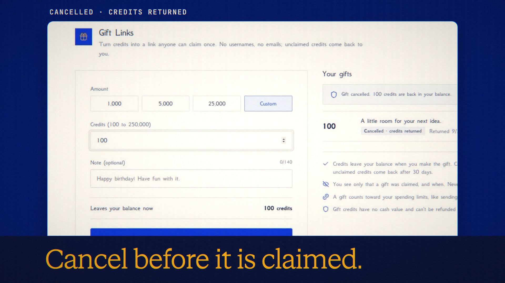

# Gift Links

**Code release · 27 September 2026 · hosted release live**

A link anyone can claim, without giving the sender a username or email.

[Public release commit](https://github.com/Anonyma-RH/Anonyma/commit/d9380de0539912141e0900a91d986cfa5854def2). The release code is published and deployed at [askanonyma.com](https://askanonyma.com). Production health, exact build revision and all ten feature flags were verified on 2026-09-27T20:16:08.130Z. Deployment used the locally verified application after the owner authorized manual deployment without GitHub Actions. The film remains local demonstration footage.

[Download the 19-second film](../assets/releases/gift-links.mp4)

## Demonstrated behavior

A gift of 100 synthetic local credits was created, its QR card inspected, then cancelled. The balance returned.

## Limits

Unclaimed credits return after 30 days. Cancelling a gift still counts toward the day’s spending limit. Gift credits have no cash value and cannot be refunded to cash.

## Media provenance

Edited real UI captures from a local batch 7 app, using synthetic inputs and real provider responses where applicable. Camera moves and titles are authored; the clip is not continuous realtime screen recording. No production customer data or fabricated product output. 1920×1080, 30 fps, H.264 with an original synthesized soundtrack.

Docs and original artwork: CC BY-NC 4.0. Code: PolyForm Noncommercial 1.0.0. See [LICENSE](../../LICENSE) and [NOTICE](../../NOTICE).
