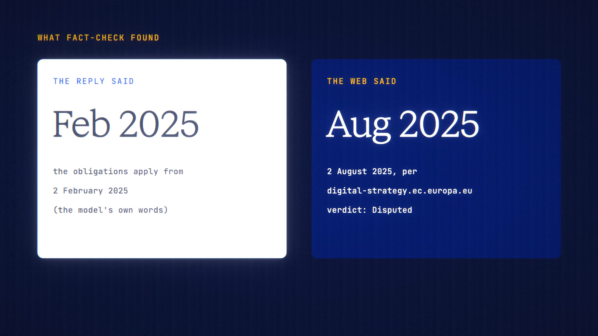

# Highlight & Ask is live

**Hosted feature release · September 2026**

Select any part of a reply and ask about just that part, or fact-check it
against the web.

Select text in a reply and a small toolbar appears:

- **Ask about this, Explain, Simplify, Translate:** each puts the selection in
  your composer as a quote with a short instruction, so you can edit it before
  sending. It bills as a normal message.
- **Fact-check:** runs a web search, with the maximum cost shown first. It
  returns one verdict (Supported, Disputed, Mixed or Couldn't verify), a short
  reason and 1–3 sources. Every source is a page the search returned. The check
  is saved as a normal turn, so History, Bookmarks, Export and Share work.

Only the selected text is sent for a fact-check, not the rest of the chat. If
Veil masked anything in the selection, fact-check declines. In Sealed Mode, only
the quote actions are available.

[Download the 22-second launch film](../assets/releases/highlight-and-ask.mp4)

## Video validation

A 22-second launch film recorded on the Highlight & Ask build, on a local demo
account. Claude Haiku 4.5 answered a question about the EU AI Act, and its reply
said the rules for general-purpose models applied from 2 February 2025.

- **Verdict:** Fact-check on that sentence returned Disputed. Its two sources,
  both digital-strategy.ec.europa.eu pages the search returned, give 2 August
  2025.
- **Cost:** the maximum shown was 63.96 credits and the check charged 25.05.

1920×1080, 30 fps, H.264, no audio, metadata removed.

Docs and original artwork: CC BY-NC 4.0. Code: PolyForm Noncommercial 1.0.0.
See [LICENSE](../../LICENSE) and [NOTICE](../../NOTICE).
