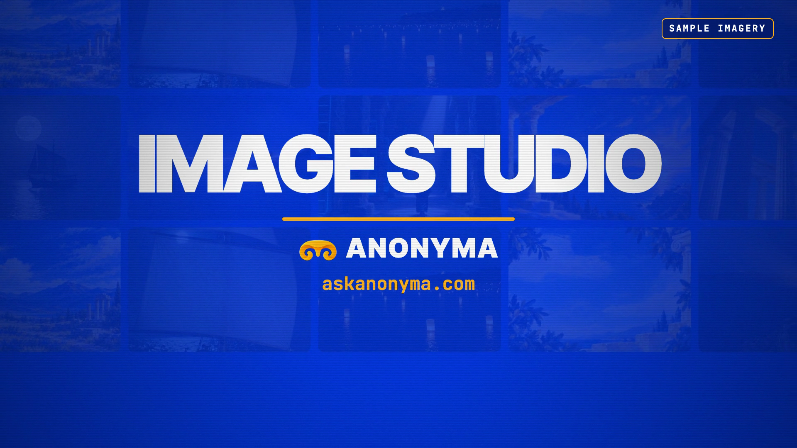

# Image Studio

**Hosted feature release · September 25, 2026**

Create images from prompts, guide supported models with a reference image, and keep completed results in your private library.

[Open Image Studio](https://askanonyma.com/workspace/image)

[Download the launch film](../assets/releases/image-studio.mp4)

## What ships and limitations

Available sizes, qualities and reference support depend on the selected model and its published prices. Generation uses prepaid credits; requests can fail or take time.

## Film

The film combines original animated graphics with a labeled local demonstration. Its reference image and example output are illustrative, not evidence that every provider returns the same result.

The 20.2-second 1920×1080, 30 fps H.264/AAC export passed full decode, audio headroom, text-recognition and visual checks on SHA-256 3cd60e1bbf4349073cc0fcb5d87b704e4444087a46900418708bc54029327497.

## X draft

From words to a world you can see.

ANONYMA Image Studio is live.

Create with image models, guide supported models with a reference, and keep the results in your library.

https://askanonyma.com

Docs and original artwork: CC BY-NC 4.0. Code: PolyForm Noncommercial 1.0.0. See [LICENSE](../../LICENSE) and [NOTICE](../../NOTICE).
