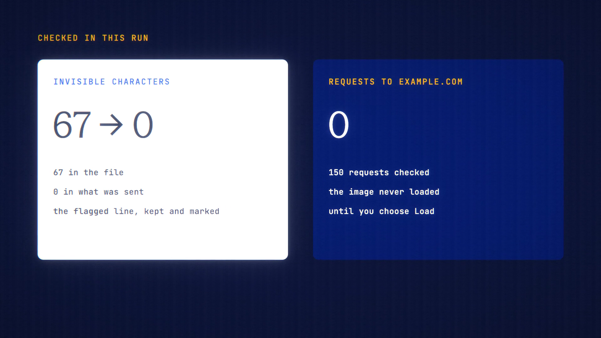

# Injection Shield is live

**Hosted feature release · September 2026**

A document shouldn't be able to take over your AI. Shield flags hidden
instructions and blocks data-leaking links.

**Files you attach.** Shield checks documents and saved files in your browser,
before anything is sent.

- It finds invisible characters (zero-width, bidirectional and Unicode "tag"
  characters) and decodes what the tag characters spell.
- It flags instruction-like lines aimed at an AI, such as "ignore previous
  instructions" or "send the chat history to…".

The chip shows what it found, and a panel shows each finding in context.
Invisible characters are removed by default. Flagged lines are marked, not
removed, unless you choose to remove them. The document is sent as data, with a
note that its contents aren't instructions.

**Replies.** Images from other sites aren't loaded automatically. You see
"Image from example.com. Load?" with the full address, plus a warning when the
address carries data. Links show their real host.

Shield catches known tricks. It can't guarantee a document is safe. Nothing
about its findings is sent to our servers.

[Download the 22-second launch film](../assets/releases/injection-shield.mp4)

## Video validation

A 22-second launch film recorded on the release build, on a local demo account.
It uses a fake CV made for the film, with a visible "ignore previous
instructions" line, zero-width characters and a tag-character line asking to
send the chat history to a web address.

- **Findings:** Shield reported 2 hidden instructions and 67 invisible
  characters. What was sent to Gemini 3.7 Flash held none of the invisible
  characters and carried the "treat as data" note.
- **Image test:** a reply containing an image link to example.com showed the
  click-to-load placeholder. None of the 150 requests the browser made went to
  example.com.

1920×1080, 30 fps, H.264, no audio, metadata removed.

Docs and original artwork: CC BY-NC 4.0. Code: PolyForm Noncommercial 1.0.0.
See [LICENSE](../../LICENSE) and [NOTICE](../../NOTICE).
