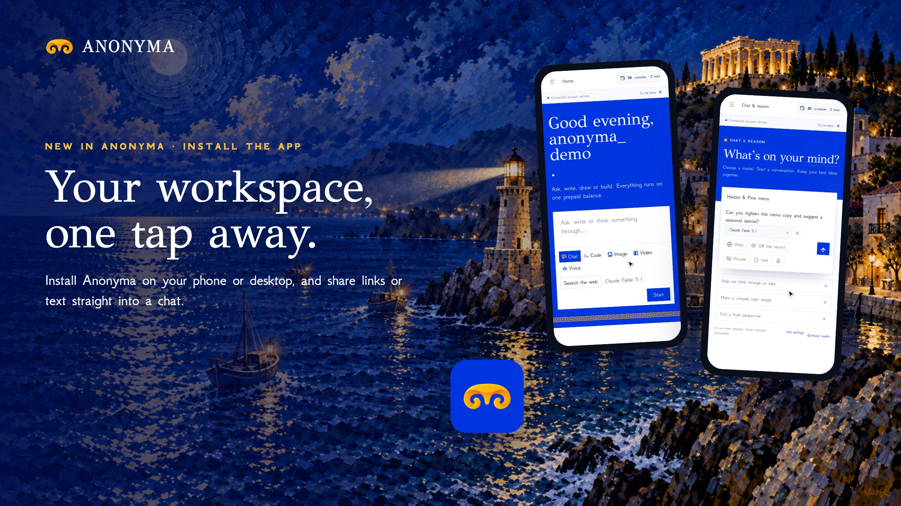

# Install the App is live

**Hosted feature release · September 25, 2026**

Your workspace, one tap away.

ANONYMA can be installed from your browser on Android or desktop and opens
straight into your workspace in its own window. On Android, share a link or
some text from another app and it lands in a new chat, ready to send.

## Notes

Pages always come from the network; only hashed assets are cached, and an
offline page shows in English or 中文 to match your language setting.

Docs and original artwork: CC BY-NC 4.0. Code: PolyForm Noncommercial 1.0.0.
See [LICENSE](../../LICENSE) and [NOTICE](../../NOTICE).
