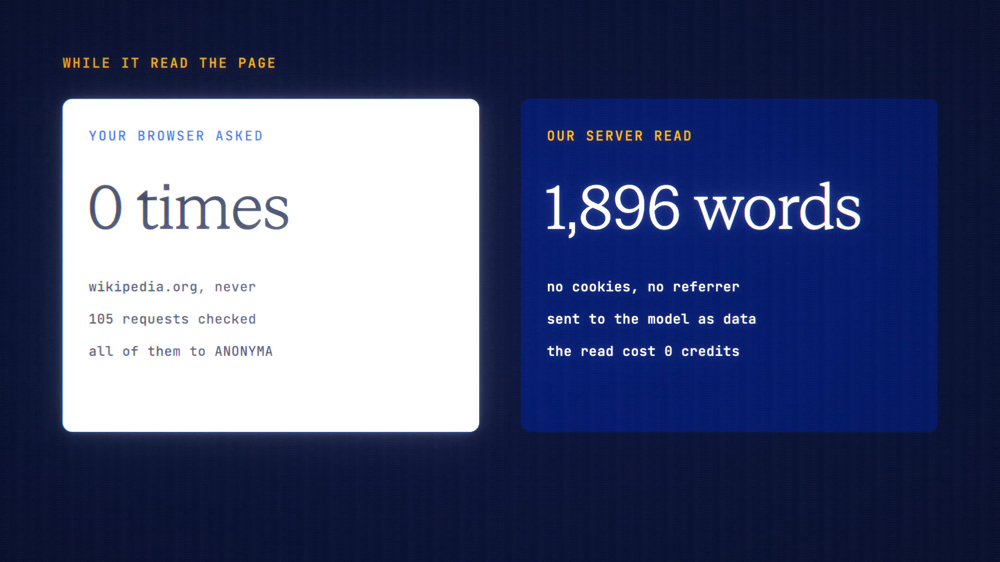

# Link Reader is live

**Hosted feature release · September 2026**

Paste a link and ask about the page. The site sees our server, not you.

When the composer holds a link, **Read this page** fetches it from ANONYMA's
server. The fetch sends no cookies and no referrer, and uses a generic user
agent. It reads only http(s) on the standard ports, with vetted redirects and
size and time limits. Private and internal addresses are refused, and the
resolved address is pinned so DNS rebinding can't redirect it.

The page's readable text becomes a card with the title, site, word count and
"Fetched by ANONYMA, not your browser". You can view the text, and it's attached
to your message as data.

- Reading is free and rate-limited; the model call bills as a normal message.
- URLs aren't logged, and nothing is stored beyond the chat message itself.

[Download the 22-second launch film](../assets/releases/link-reader.mp4)

## Video validation

A 22-second launch film recorded on the release build, on a local demo account.
Link Reader read en.wikipedia.org/wiki/Onion_routing: 1,896 words, fetched by
the server. Claude Haiku 4.5 then answered for 4.5998 credits; the read itself
cost nothing.

The recording browser made no requests to wikipedia.org or wikimedia.org. All
105 requests it made went to the ANONYMA server.

1920×1080, 30 fps, H.264, no audio, metadata removed.

Docs and original artwork: CC BY-NC 4.0. Code: PolyForm Noncommercial 1.0.0.
See [LICENSE](../../LICENSE) and [NOTICE](../../NOTICE).
