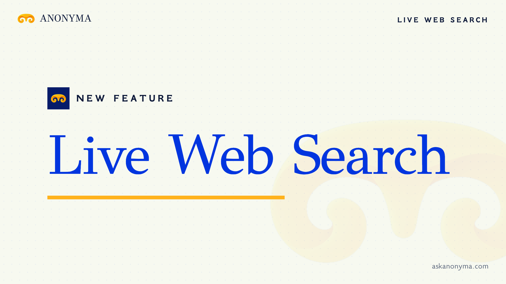

# Live Web Search is live

**Hosted feature release · September 24, 2026**

Bring the web into the conversation.

[Open Anonyma chat](https://askanonyma.com/workspace/chat), turn on **Web**, and ask
about something on the web. Follow the sources returned beneath the answer.
Code & Build remains available and the model catalog stays at ten chat models.

[Download the 14-second launch film](../assets/releases/live-web-search.mp4)

## Activation

The Live Web Search entry in `server/releases.js` now has `released: true`.
This commit activates search alongside the existing Code & Build release when
`RELEASED_FEATURES=mvp`. The seven later feature releases retain their gates.

## Pricing and limitations

Search adds a $0.0211 charge per request, plus model usage. The app reserves an
estimate and settles the actual charge against the prepaid balance. Returned
sources depend on the provider and the question; citations are not a guarantee
that an answer is correct. Check linked sources before relying on an answer.

## Run locally

Follow the [local setup](../../README.md#run-locally) and set
`RELEASED_FEATURES=mvp`. Local test mode simulates responses; real web searches
require a configured provider that supports the web plugin.

## Video validation

The launch film is 1920×1080, 30 fps, H.264 with stereo AAC audio. Its text is
checked with Tesseract, including a 42-frame sweep. It uses the feature name and
a “Live now” end card for this hosted release.

Docs and original artwork: CC BY-NC 4.0. Code: PolyForm Noncommercial 1.0.0.
See [LICENSE](../../LICENSE) and [NOTICE](../../NOTICE).
