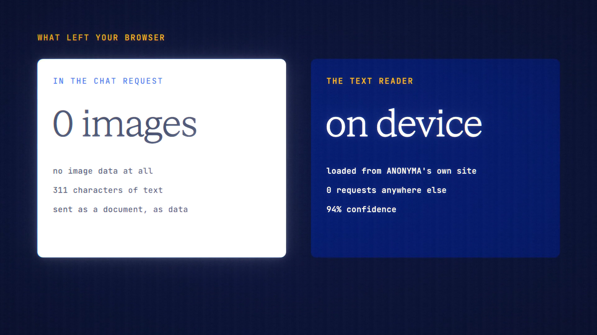

# Local OCR is live

**Hosted feature release · September 2026**

Pull the text out of a screenshot on your device, and send just the words. The
AI never sees the image.

On an attached image, **Text only** reads the text in your browser. You get an
editable panel with a confidence note and a language picker (English and
Simplified Chinese). **Use text** replaces the image with a text attachment, sent
as data, and the image is dropped.

- The text reader and its language data are served by ANONYMA itself, with no
  outside CDN.
- A text attachment usually costs less than an image. With a vision-capable
  model you see the comparison before sending.
- You can redact first, then read the redacted copy.

OCR can misread text; check it before sending.

[Download the 22-second launch film](../assets/releases/local-ocr.mp4)

## Video validation

A 22-second launch film recorded on the Local OCR build, on a local demo
account. The screenshot was a receipt made for the film. It was read in the
browser with 94% confidence, then Claude Haiku 4.5 answered from the words for
0.421 credits.

- The chat request carried no image data: only 311 characters of text, sent as
  a document.
- The text reader loaded from the app's own site, with no requests anywhere
  else.

1920×1080, 30 fps, H.264, no audio, metadata removed.

Docs and original artwork: CC BY-NC 4.0. Code: PolyForm Noncommercial 1.0.0.
See [LICENSE](../../LICENSE) and [NOTICE](../../NOTICE).
