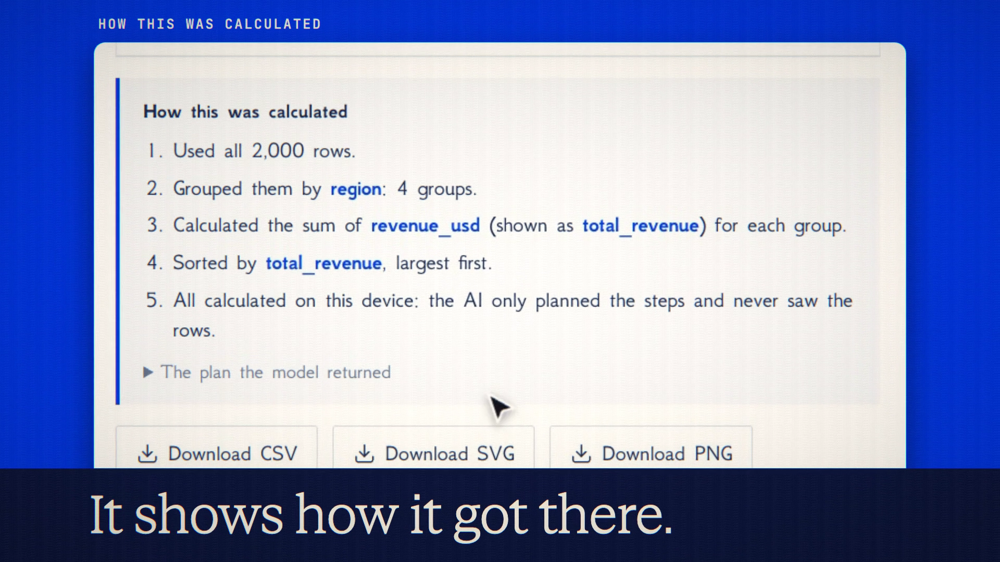

# Local Sheets is live

**Hosted feature release · September 2026**

Ask questions about a spreadsheet without uploading it.

Open **Sheets** and drop in a CSV, TSV or JSON file. It's parsed and kept in
your browser.

**What the AI sees:** the column names, types, row count, distinct counts and,
by default, each date column's first and last date. You can switch the dates
off. The "What the AI sees" panel shows exactly what goes, and sample rows are
off unless you tick them.

The model answers with a small, strictly checked query plan, never code. Your
browser then runs it and draws the result as a table and chart. "How this was
calculated" explains each step, and you can download the result as CSV, SVG or
PNG.

- **Explain this result** sends only the small result table, after showing it
  to you.
- A Sheets session isn't saved on our servers, and model calls are off the
  record.

[Download the 22-second launch film](../assets/releases/local-sheets.mp4)

## Video validation

A 22-second launch film recorded on the release build, on a local demo account,
with a fake 2,000-row sales CSV made for the film. Claude Haiku 4.5 returned a
plan for revenue by region, which ran in the browser. The plan cost 1.302
credits.

Every request that left the browser was checked. They carried the column names,
types, counts and first and last dates. They held none of the file's product
names and none of its revenue figures.

1920×1080, 30 fps, H.264, no audio, metadata removed.

Docs and original artwork: CC BY-NC 4.0. Code: PolyForm Noncommercial 1.0.0.
See [LICENSE](../../LICENSE) and [NOTICE](../../NOTICE).
