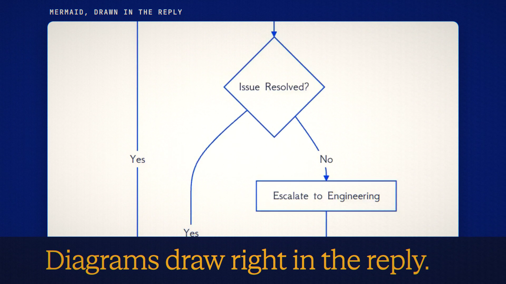

# Math & Diagrams is live

**Hosted feature release · September 2026**

Equations and diagrams, right in the chat.

Replies now render LaTeX math (inline and display, typeset with KaTeX) and
Mermaid diagrams. Each display equation and diagram has **Show source** and
**Copy SVG**, and diagrams also have **Download PNG**.

- Mermaid runs in strict mode with no HTML labels, and its SVG is sanitised. A
  diagram that can't be drawn falls back to its code with a short note.
- KaTeX and Mermaid load only when a reply needs them.
- Currency stays text: "$5 and $10" isn't turned into math.
- It works wherever replies render: chats, Symposium, shared chats and exports.

[Download the 22-second launch film](../assets/releases/math-and-diagrams.mp4)

## Video validation

A 22-second launch film recorded on the release build, on a local demo account.
It shows a real Claude Haiku 4.5 reply containing the quadratic formula as a
display equation, a Mermaid flowchart of a support-ticket process, and the
sentence "Plans cost $5 and $10.", which stayed plain text. It then uses Show
source and Copy SVG; the copy produced a 107,835-byte SVG.

1920×1080, 30 fps, H.264, no audio, metadata removed.

Docs and original artwork: CC BY-NC 4.0. Code: PolyForm Noncommercial 1.0.0.
See [LICENSE](../../LICENSE) and [NOTICE](../../NOTICE).
