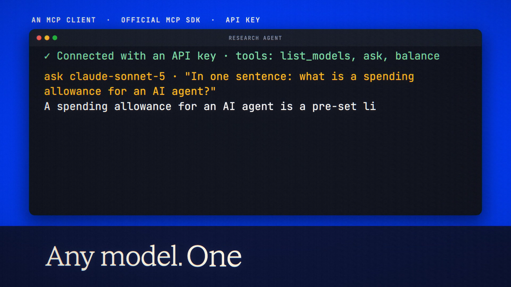

# MCP Server is live

**Hosted feature release · September 25, 2026**

Your balance, inside your AI tools.

ANONYMA is now a remote MCP server at askanonyma.com/mcp. Make an API key in
Account → API keys, then add ANONYMA to Claude Code with one command, or to
Cursor and other MCP clients with a short config. It offers three tools:
`list_models`, `ask` (any callable chat model, billed from your balance, with a
signed receipt) and `balance`.

[Download the 16-second launch film](../assets/releases/mcp-server.mp4)

## Notes

Requests from an AI tool spend from the same balance and appear on the same
ledger as the web workspace. Keys can carry an allowance, an expiry and a pause
switch ([Agent Allowances](agent-allowances.md)), and apps that support sign-in
can connect without a key ([Connect an App](connect-an-app.md)).

## Video validation

A 16-second launch film: a key made in Account on the released build, then a
local MCP client built on the official MCP TypeScript SDK using that key as a
Bearer token to list its tools and get an answer from Claude Sonnet 5 with a
signed receipt. The Claude Code command shown is the product's own snippet for
askanonyma.com. 1920×1080, 30 fps, H.264, no audio, metadata removed.

Docs and original artwork: CC BY-NC 4.0. Code: PolyForm Noncommercial 1.0.0.
See [LICENSE](../../LICENSE) and [NOTICE](../../NOTICE).
