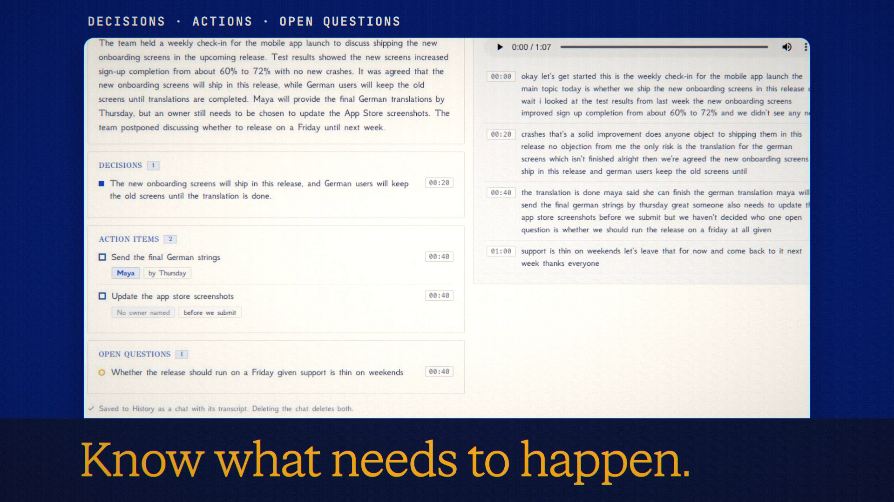

# Meeting Notes

**Code release · 27 September 2026 · hosted release live**

Turn a recording into a transcript, decisions, action items and open questions.

[Public release commit](https://github.com/Anonyma-RH/Anonyma/commit/ec0bd6e65f13b2b4f34c9a685e14b29a77d9db5a). The release code is published and deployed at [askanonyma.com](https://askanonyma.com). Production health, exact build revision and all ten feature flags were verified on 2026-09-27T20:16:08.130Z. Deployment used the locally verified application after the owner authorized manual deployment without GitHub Actions. The film remains local demonstration footage.

[Download the 19-second film](../assets/releases/meeting-notes.mp4)

## Demonstrated behavior

A synthetic 68-second recording was transcribed by Nova 3 and summarized by Gemini 3.7 Flash. It returned one decision, two action items and one open question; an unnamed owner stayed unnamed. Timestamp navigation was exercised.

## Limits

Only sound is sent for transcription, in pieces up to five minutes. The source file, filename, tags and video remain local. ANONYMA does not store the recording. No speaker labels are promised. Timestamp precision depends on the provider. This tool is unavailable in Private Mode. Exports include Markdown, TXT and SRT.

## Media provenance

Edited real UI captures from a local batch 7 app, using synthetic inputs and real provider responses where applicable. Camera moves and titles are authored; the clip is not continuous realtime screen recording. No production customer data or fabricated product output. 1920×1080, 30 fps, H.264 with an original synthesized soundtrack.

Docs and original artwork: CC BY-NC 4.0. Code: PolyForm Noncommercial 1.0.0. See [LICENSE](../../LICENSE) and [NOTICE](../../NOTICE).
