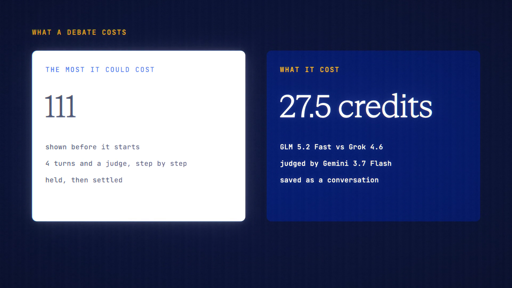

# Model Debate is live

**Hosted feature release · September 2026**

Pick a question and two models. Let them argue.

Model Debate sets two models against each other on a question, over one to four
rounds, then asks a third model to judge.

- The defaults are GLM 5.2 Fast against Grok 4.6, judged by Gemini 3.7 Flash.
  You can pick others.
- The judge sees the sides as A and B, without the model names, and returns the
  strongest point on each side, where each was weak, a verdict (or "too close to
  call") and what would settle it.
- The most it can cost is shown first, with the cost of each step, and equals
  the amount held. Each step settles on what it used; if a turn fails, the rest
  is released.
- The debate is saved as a conversation you can reopen or export.

[Download the 23-second launch film](../assets/releases/model-debate.mp4)

## Video validation

A 23-second launch film recorded on the release build now in production, on a
local demo server: GLM 5.2 Fast against Grok 4.6 over two rounds, judged by
Gemini 3.7 Flash.

- The page showed "Up to 111 credits" with the cost of each step, and the amount
  held matched that sum. The debate cost 27.50 credits.
- The judge's prompt labelled the sides A and B only, with no model names; the
  names appeared after the verdict.
- The debate was saved as a conversation.

1920×1080, 30 fps, H.264, no audio, metadata removed.

Docs and original artwork: CC BY-NC 4.0. Code: PolyForm Noncommercial 1.0.0.
See [LICENSE](../../LICENSE) and [NOTICE](../../NOTICE).
