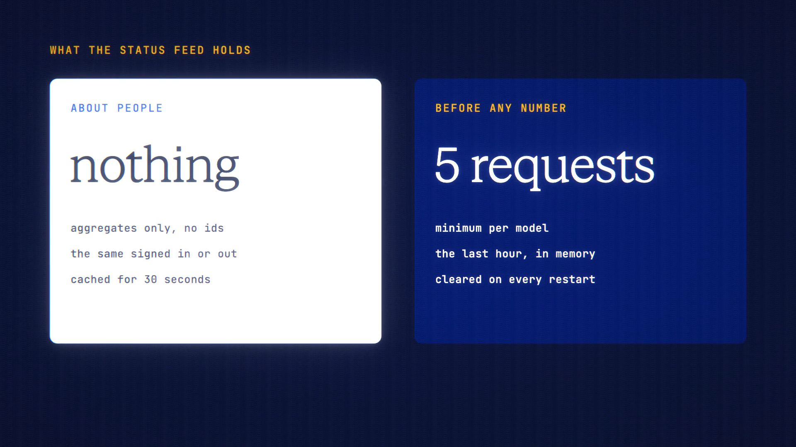

# Model Status is live

**Hosted feature release · September 2026**

See which models are up, and how fast they are, before you spend a credit.

The public **/status** page shows each model family as Up, Degraded or Down,
based on the last 15 minutes. It also shows the median and 90th-percentile time
to first token over the last hour, and when it was last checked. The model
picker has a small status dot beside each model, and the workspace warns you
when the model you picked is down. `GET /api/status` serves the same figures.

- Status is measured from ANONYMA's own traffic in the last hour, aggregated,
  and never shows who sent a request.
- No numbers appear until a model has at least 5 requests. Until then it shows
  "Not enough data".
- The figures are kept in memory only, and reset whenever the service restarts.

Measured from ANONYMA's own traffic in the last hour. It isn't a promise from
the provider.

[Download the 23-second launch film](../assets/releases/model-status.mp4)

## Video validation

A 23-second launch film recorded on the release build now in production, on a
local demo server. Its only traffic was the recorder's own 18 real requests, six
each to Claude Haiku 4.5, Gemini 3.7 Flash and GPT-5.4 Mini, which all succeeded.

- Those three models show as Up, with times matching what was measured.
- Every other family shows "Not enough data", and none is shown as degraded or
  down.
- `/api/status` held only aggregates, and was identical signed in and signed out.

1920×1080, 30 fps, H.264, no audio, metadata removed.

Docs and original artwork: CC BY-NC 4.0. Code: PolyForm Noncommercial 1.0.0.
See [LICENSE](../../LICENSE) and [NOTICE](../../NOTICE).
