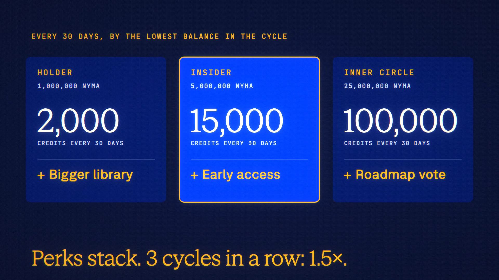

# The NYMA Holder Program is live

**Hosted feature release · September 25, 2026**

Hold NYMA, use ANONYMA for free.

Link a wallet once by signing a message (no transaction, no approval, nothing to
spend) and keep your NYMA in your own wallet. Every 30 days, ANONYMA credits land
in your balance, set by the lowest amount the wallet held during that cycle:

| Tier | Lowest balance | Credits every 30 days | Perk |
|---|---|---|---|
| Holder | 1,000,000 NYMA | 2,000 | Bigger library: 600 saved conversations, 300 Symposium runs, a larger media library |
| Insider | 5,000,000 NYMA | 15,000 | Early access to new features |
| Inner Circle | 25,000,000 NYMA | 100,000 | A monthly roadmap vote (advisory) |

Perks stack. After 3 paid cycles in a row, each payout is 1.5×; the bonus resets
if a cycle ends below 1,000,000 NYMA. The first early-access feature is the
Multimodal API: images, speech, transcription and video through `/v1` with an API
key, for Insiders and up.

There is no staking, locking, deposit or escrow. Linking is optional, the wallet
can be unlinked at any time, connected apps never learn you hold NYMA, and you
never need NYMA to use ANONYMA. Rewards are ANONYMA credits. Details:
askanonyma.com/token. NYMA is an ERC-20 on Robinhood Chain,
`0x968be0c1a394bf1ce239e3b40909ec0f9d4f5583`.

[Download the 30-second launch film](../assets/releases/nyma-holder-program.mp4)

## Video validation

A 30-second launch film recorded on the released build with its token reads
pointed at a local test chain and a throwaway test wallet holding 6,000,000 test
NYMA, so no real tokens, wallet or funds were involved. It shows /token, linking
the wallet by signature, Account → NYMA holdings at the Insider tier, the
roadmap's early-access card, and one API key calling the Multimodal API before
linking (403, "coming soon") and after (200, a real image, 21.78 credits, with a
signed receipt). 1920×1080, 30 fps, H.264, no audio, metadata removed.

Docs and original artwork: CC BY-NC 4.0. Code: PolyForm Noncommercial 1.0.0.
See [LICENSE](../../LICENSE) and [NOTICE](../../NOTICE).
