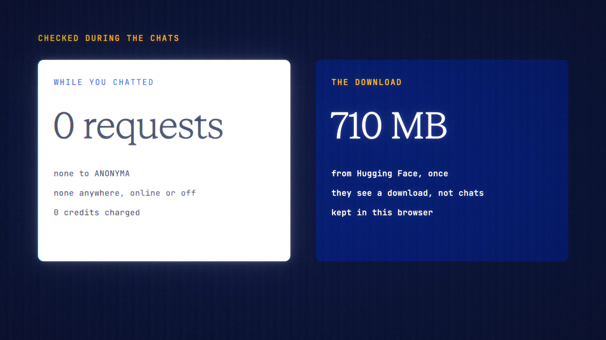

# On-Device Model is live

**Hosted feature release · September 2026**

Chat with a model that runs entirely on your device. It's free, it keeps
answering with the connection off once the page is open, and nothing is sent
anywhere.

Choose **On-device model** in the model picker and pick a small model, such as
Llama 3.2 1B (710 MB) or a Qwen 2.5 model. Its size is shown before you download
it. It downloads once from Hugging Face, who see a download, not your chats. It's
then kept in your browser's storage, and you can remove it at any time to free
the space.

- Replies run on your device: no credits, and nothing is sent to ANONYMA or
  anyone else.
- On-device chats aren't saved on our servers. Web, files and memory are off.
- It needs WebGPU: recent Chrome or Edge on desktop, or Safari where WebGPU is
  enabled.

Small models are weaker than the large ones in the catalog. Built with Llama:
Llama 3.2 is licensed under the Llama 3.2 Community License.

[Download the 25-second launch film](../assets/releases/on-device-model.mp4)

## Video validation

A 25-second launch film recorded on the On-Device Model build, in headless
Chrome with WebGPU. Llama 3.2 1B downloaded once (710 MB) and answered two real
questions, at 89 and 97 tokens a second. The second was answered with the
network cut.

- **Requests:** none of any kind while chatting, online or offline.
- **Credits:** 0 charged.
- **The download:** came from Hugging Face.

1920×1080, 30 fps, H.264, no audio, metadata removed.

Docs and original artwork: CC BY-NC 4.0. Code: PolyForm Noncommercial 1.0.0.
See [LICENSE](../../LICENSE) and [NOTICE](../../NOTICE).
