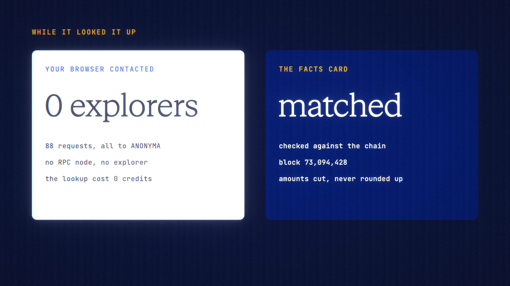

# Onchain Explainer is live

**Hosted feature release · September 2026**

Paste a transaction hash or wallet address. Get it explained in plain English.
The explorer never sees you.

When the composer holds a transaction hash, an address or an explorer link,
**Explain on-chain** looks it up from ANONYMA's server, so your IP never
reaches the explorer. It covers Robinhood Chain, Ethereum, Base, Arbitrum and
Optimism.

The **Chain facts** card comes straight from the data, not from the model. It
shows:
- status, time, from and to;
- value, token transfers, fee and block.

Then your chosen model explains those facts, and only those. The lookup is free;
the explanation bills as a normal message.

- Read-only: it never signs, never sends and never connects a wallet.
- Hashes and addresses aren't logged. Lookups are cached for 60 seconds and
  rate-limited.

[Download the 22-second launch film](../assets/releases/onchain-explainer.mp4)

## Video validation

A 22-second launch film recorded on the release build, on a local demo account.
It explains a real NYMA buy on Robinhood Chain: 0.025 ETH for 317,853.79 NYMA
through the Uniswap v4 PoolManager, in block 73,094,428. Claude Haiku 4.5 wrote
the explanation for 2.8538 credits; the lookup itself was free.

- The facts card matched an independent read of the chain.
- The recording browser made 88 requests, all to the ANONYMA server, and none
  to any explorer or RPC host.
- The buyer's full wallet address, which the model wrote out, is hidden in the
  film.

1920×1080, 30 fps, H.264, no audio, metadata removed.

Docs and original artwork: CC BY-NC 4.0. Code: PolyForm Noncommercial 1.0.0.
See [LICENSE](../../LICENSE) and [NOTICE](../../NOTICE).
