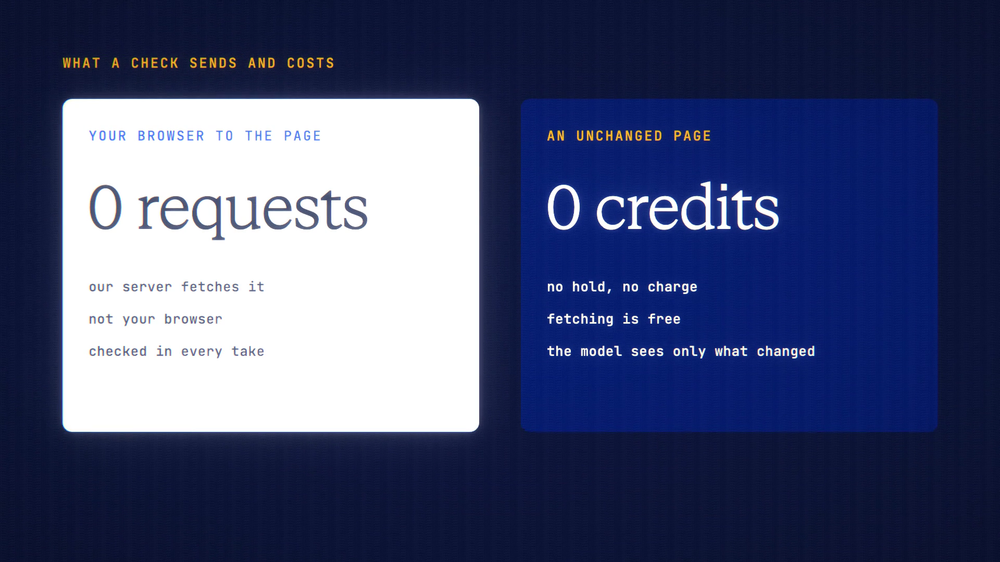

# Page Watch is live

**Hosted feature release · September 2026**

Watch a web page. Hear when it changes.

Give Page Watch a web address and choose how often to check it: every 6 hours,
daily or weekly. ANONYMA's server fetches the page on that schedule, not your
browser, and compares its readable text with the last version. When something
real changed, the model you picked summarises what changed, and the report lands
in your results with a badge in the workspace. There is no email.

- **No change, no charge.** Fetching and comparing are free. Credits are spent
  only when the model reads a real change, and each watch has its own monthly
  credit budget. A reply that can't be read, or a summary that fails, isn't
  charged.
- **"Only tell me if…"**: add a hint such as "a new story reaches the top 5",
  and the model first decides whether the change matters. You only get a summary
  when it does. The model sees only the lines that changed, with a little context,
  not the whole page.
- Local and private network addresses are refused.
- Up to 20 watches per account. After 5 failed fetches in a row a watch pauses,
  with a note saying why.

ANONYMA keeps the last version of the page to spot changes. Delete the watch to
delete it.

[Download the 23-second launch film](../assets/releases/page-watch.mp4)

## Video validation

A 23-second launch film recorded on the Page Watch build, on a local demo server
with a fresh database, using Gemini 3.7 Flash. The watched pages were
news.ycombinator.com and the GNU GPL page.

- The browser never requested either site. Its only host was the local server.
- A link to 127.0.0.1 was refused before anything was fetched, as were
  `localhost`, `[::1]` and a name that resolves to 127.0.0.1.
- The GPL check found no change: no hold, no charge, and the kept copy was left
  as it was.
- The Hacker News change report cost 0.9158 credits. Its second point, about an
  unrelated headline, is outside the film's frame.

1920×1080, 30 fps, H.264, no audio, metadata removed.

Docs and original artwork: CC BY-NC 4.0. Code: PolyForm Noncommercial 1.0.0.
See [LICENSE](../../LICENSE) and [NOTICE](../../NOTICE).
