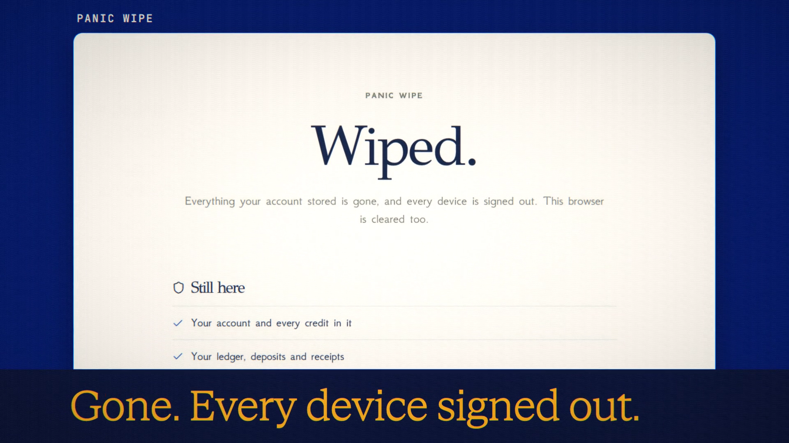

# Panic Wipe is live

**Hosted feature release · September 2026**

Wipe everything. Keep your credits.

In Account → Settings, **Wipe everything now** erases what your account has
stored in one step, and signs you out on every device. You type WIPE to
confirm. The server removes it all in a single transaction with secure delete
on, so the deleted rows are overwritten in the database file rather than left
behind.

**What goes:** chats and messages, including Symposium runs, branches and share
links; saved images, video and audio, and the files themselves; saved uploads
and video jobs; memory facts, Scrolls and standing instructions; routines and
their inbox; collabs you own; support requests you sent while signed in; API keys and connected apps
(revoked); every sign-in on every device; and everything ANONYMA keeps in this
browser, such as drafts, Veil words, caches and Device Vault chats.

**What stays:** your account and every credit in it; your ledger, deposits and
receipts; your settings, such as spending limits and auto-delete; what you
wrote in other people's collabs (you leave those collabs); the records the
data-controls guide says are always kept; and your language choice.

[Download the 22-second launch film](../assets/releases/panic-wipe.mp4)

## Notes

- A wipe can't reach copies outside your account: exports you downloaded, data
  already sent to AI providers, and server backups. Backups are separate copies
  and aren't wiped instantly.
- It can't be undone. Export your data first if you want a copy.
- It's refused while a request is still running, or while a wallet payment
  from this browser is still being confirmed; try again once it's done.

## Video validation

A 22-second launch film recorded in one take on the Panic Wipe build, on a
local demo account seeded with five real chats (Claude Haiku 4.5), two memory
facts, a Scroll and a saved file. After the wipe, signing in again showed an
empty workspace. The API returned no chats, memory facts, Scrolls or saved
files, the earlier session was signed out, and the balance read 293.033 credits
before and after. 1920×1080, 30 fps, H.264, no audio, metadata removed.

Docs and original artwork: CC BY-NC 4.0. Code: PolyForm Noncommercial 1.0.0.
See [LICENSE](../../LICENSE) and [NOTICE](../../NOTICE).
