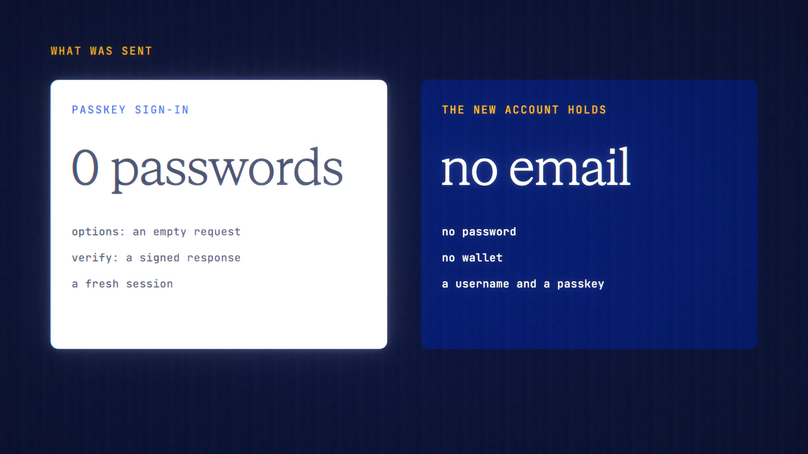

# Passkeys are live

**Hosted feature release · September 2026**

Sign in with Face ID or your fingerprint. No password to leak, no email needed.

In **Account → Security**, add a passkey and name it, for example "iPhone".
Adding or removing one asks you to confirm it's you first. Your list shows each
passkey's name, when it was added and when it was last used, and you can rename
or remove it.

- **Sign in with a passkey** needs no username or password.
- **Create an account with a passkey** needs only a username: no password, no
  email.
- A passkey sign-in counts as both steps of Two-Step Sign-in.
- Passkeys are bound to askanonyma.com, so a look-alike site can't use them.
- Removing your last way to sign in is refused.
- Repeated failures lock a passkey for 15 minutes.

[Download the 22-second launch film](../assets/releases/passkeys.mp4)

## Video validation

A 22-second launch film recorded on the release build. It used a separate local
demo server and a virtual authenticator in the browser, not a real device or
account.

- **Adding:** a passkey named "iPhone" was added after confirming the demo
  password.
- **Signing in:** after signing out, "Sign in with a passkey" signed straight
  back in. Those requests carried no password: an empty options request, then
  the signed response.
- **New account:** a second account was created with only a username and a
  passkey, and it holds no password, email or wallet.

1920×1080, 30 fps, H.264, no audio, metadata removed.

Docs and original artwork: CC BY-NC 4.0. Code: PolyForm Noncommercial 1.0.0.
See [LICENSE](../../LICENSE) and [NOTICE](../../NOTICE).
