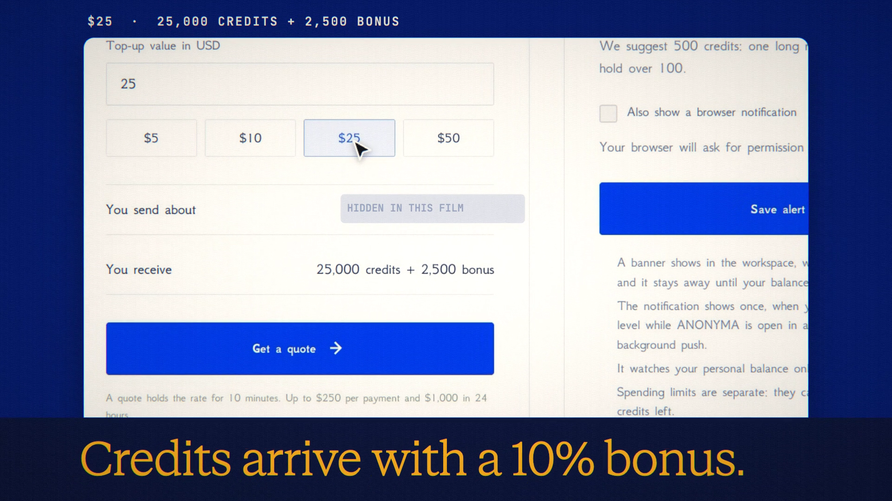

# Pay with NYMA is live

**Hosted feature release · September 2026**

Top up with NYMA.

In Credits, **Pay with** now has a NYMA tab beside USDG:

1. Link the wallet you'll pay from.
2. Choose a top-up value in USD.
3. Get a quote. It says exactly how much NYMA to send, and to which address.
4. Send that amount from your own wallet on Robinhood Chain.

The transfer is matched on-chain to your linked wallet, and your credits arrive
with a 10% bonus. If needed, you can check a transfer by its transaction hash.

- The conversion rate is the lower of the current rate and its 30-minute average
  on Robinhood Chain, so a sudden jump never raises it.
- A quote holds for 10 minutes. Less NYMA is credited proportionally and more
  is credited in full. A transfer after the quote ends gets the lower of the
  quoted and current rates.
- The limits are $1 minimum, $250 per payment and $1,000 per day. Each
  transfer is credited once.
- If the rate moves too fast, NYMA top-ups pause for a few minutes. You can
  always pay with USDG.

You send from your own wallet. ANONYMA never asks for your keys or seed phrase.

[Download the 18-second launch film](../assets/releases/pay-with-nyma.mp4)

## Video validation

An 18-second launch film recorded on the release build, on a local demo account.
It shows screens only; no transfer was sent. A throwaway test wallet with no
funds signed the wallet link. The rate was read live from Robinhood Chain, and a
$25 quote was created and left to expire. The film hides the rate figures, the
exact NYMA amounts and the payment address. 1920×1080, 30 fps, H.264, no audio,
metadata removed.

Docs and original artwork: CC BY-NC 4.0. Code: PolyForm Noncommercial 1.0.0.
See [LICENSE](../../LICENSE) and [NOTICE](../../NOTICE).
