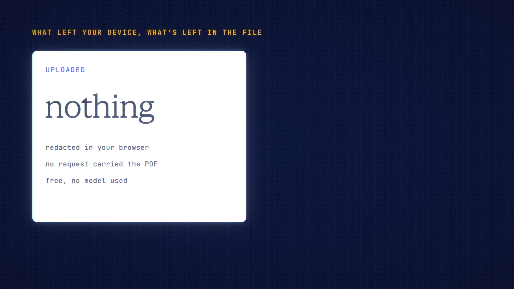

# PDF Redact is live

**Hosted feature release · September 2026**

Redact a PDF on your device before you share it.

PDF Redact works entirely in your browser. Nothing is uploaded.

- Find what to hide with search terms, one-tap detectors (emails, phone numbers,
  card-like numbers, IBANs, wallet addresses and your always-veil words), or by
  drawing boxes yourself.
- The redacted copy is a new PDF made from pictures of your pages with solid
  boxes burned in. Nothing from the original file is carried over: no text layer,
  metadata, annotations, form fields, attachments or scripts.
- The copy is read back and checked before you can download it.
- Because it's pictures of your pages, the redacted PDF's text can't be selected
  or searched.
- You can download it, or send it to chat as text through Local OCR or as page
  images.

[Download the 24-second launch film](../assets/releases/pdf-redact.mp4)

## Video validation

A 24-second launch film recorded on the release build now in production, on a
local demo server, with a made-up two-page guest registration form.

- No request carried the PDF, and no credits were used.
- The downloaded copy is two page pictures: no fonts, metadata, annotations or
  forms, and text extraction finds 0 characters.
- The detectors find emails, phone numbers, card numbers, IBANs and more; names
  and addresses were covered with search and a hand-drawn box.

1920×1080, 30 fps, H.264, no audio, metadata removed.

Docs and original artwork: CC BY-NC 4.0. Code: PolyForm Noncommercial 1.0.0.
See [LICENSE](../../LICENSE) and [NOTICE](../../NOTICE).
