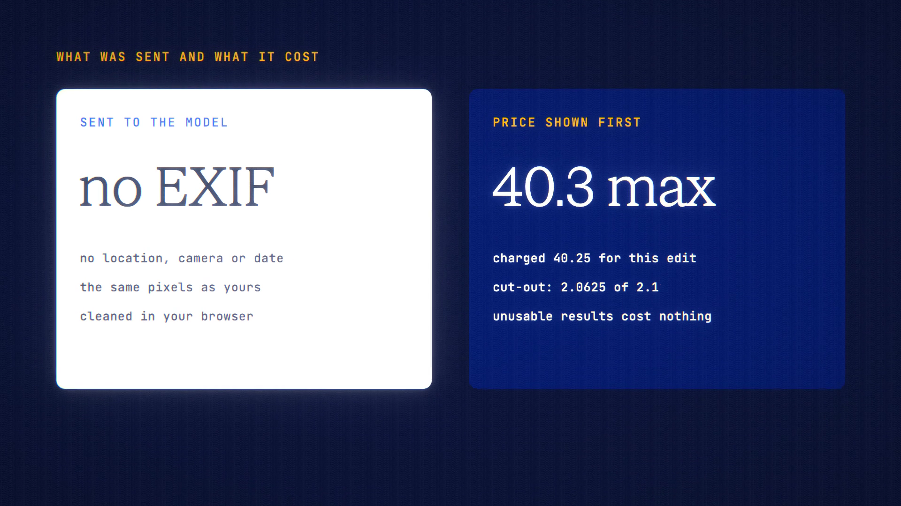

# Photo Tools is live

**Hosted feature release · September 2026**

Edit a photo with words, remove its background, or upscale it.

Photo Tools takes a photo you upload, or one from your library, and offers three tools:

- **Edit with words:** describe the change and an image-edit model makes it.
- **Remove background:** the result is a transparent PNG.
- **Upscale:** choose the upscaling model. Photos larger than 1024 px are shrunk
  to a 1024 px copy first, and the result says so.

A before-and-after slider compares the result with your photo.

- **The price comes first.** The price shown is the most you can be charged. You
  pay the provider's reported cost up to that amount, and an unusable result
  costs nothing.
- **Hidden details removed:** location, camera and author details are stripped
  from the photo in your browser before it's sent.
- Results are saved to your library. Off the record, they're returned without
  being saved.
- Photo Tools isn't available in Private Mode, because no image model offers
  zero data retention yet. Extending a photo isn't offered yet either.

[Download the 23-second launch film](../assets/releases/photo-tools.mp4)

## Video validation

A 23-second launch film recorded on the release build now in production, on a
local demo server, using an ANONYMA temple image carrying made-up location,
camera, author and date details.

- The copy sent to the server had no EXIF block, location, camera or date. Its
  pixel data was identical to the original's.
- For each tool, the price shown matched the amount held, and the charge came in
  at or under it: background removal (birefnet-v2) 2.0625 of 2.1 credits, the
  edit (Seedream V5 Lite Edit) 40.25 of 40.3, and the upscale (AuraSR) 2.0625 of
  2.1, from a 1024 px copy to 4,096 × 3,072.
- Every result was saved to the library.

1920×1080, 30 fps, H.264, no audio, metadata removed.

Docs and original artwork: CC BY-NC 4.0. Code: PolyForm Noncommercial 1.0.0.
See [LICENSE](../../LICENSE) and [NOTICE](../../NOTICE).
