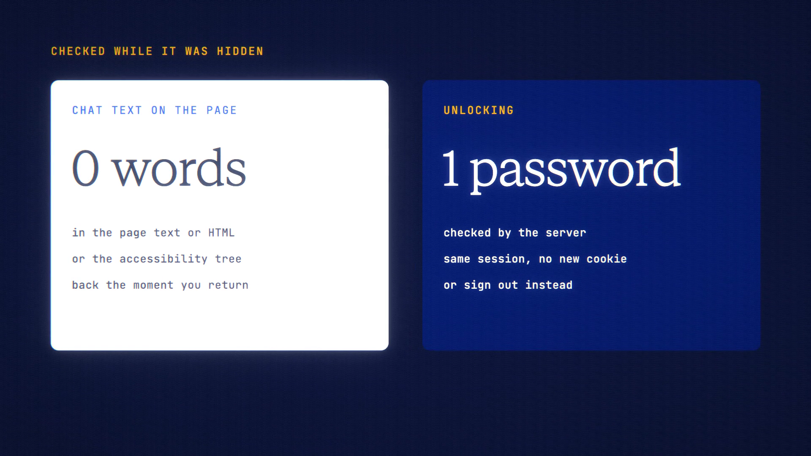

# Privacy Screen is live

**Hosted feature release · September 2026**

One key and your screen goes blank. Walk away and it locks itself.

Press **Esc** twice, or the **Hide** button, and the workspace is replaced by a
plain cover: "Hidden — press any key or tap to return". Your chats are removed
from the page, not just blurred, and replies keep streaming in the background.

In Account → Privacy Screen, two settings are saved per browser:
- **Hide when I switch away:** covers the screen when you switch tabs or apps.
- **Lock after idle** (5, 15 or 60 minutes): shows a lock screen. You unlock
  with your password, an email code or a wallet signature, or choose "Sign out
  instead". Unlocking keeps your session, and repeated failures lock unlocking
  for 15 minutes.

Privacy Screen hides your screen from people nearby. It isn't encryption. For
chats that never leave this device, use Device Vault.

[Download the 23-second launch film](../assets/releases/privacy-screen.mp4)

## Video validation

A 23-second launch film recorded on the release build, on a local demo account,
with a real Claude Haiku 4.5 chat. It shows:

- hiding with the button and with Esc Esc;
- the settings;
- the idle lock, unlocked with the demo password.

To trigger the lock without waiting, the recording browser's clock was moved
forward 5 minutes.

While the chat was hidden, none of its text was in the page text, the HTML or
the accessibility tree. Unlocking re-checked the password on the server and kept
the same session.

1920×1080, 30 fps, H.264, no audio, metadata removed.

Docs and original artwork: CC BY-NC 4.0. Code: PolyForm Noncommercial 1.0.0.
See [LICENSE](../../LICENSE) and [NOTICE](../../NOTICE).
