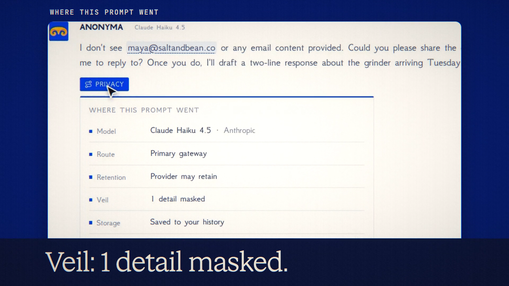

# Privacy Trail is live

**Hosted feature release · September 25, 2026**

See where every prompt went.

Every reply now has a Privacy chip. It opens "Where this prompt went": the model and
its provider, the route (primary or backup gateway), retention, Veil, storage and
the signed receipt with Verify. Retention reads "Zero data retention" only when the
request actually used zero-data-retention routing (Private Mode or a private-only
connected app); otherwise it reads "Provider may retain", with "Trains on prompts"
where the provider says so. Storage shows whether the chat was saved, off the
record or in Private Mode. It works in Symposium columns too, on `/v1` as
`anonyma.privacy` and on the MCP `ask` tool as `privacy`.

[Download the 16-second launch film](../assets/releases/privacy-trail.mp4)

## Notes

The trail is metadata only; no prompt text is stored for it.

## Video validation

A 16-second launch film cut around three real chats on the released feature: Claude
Haiku 4.5 with Veil on (1 detail masked; the model's reply shows it never received
the email), DeepSeek V4.1 Flash in Private Mode (zero data retention, not saved) and
Claude Haiku 4.5 off the record (not saved). 1920×1080, 30 fps, H.264, no audio,
metadata removed.

Docs and original artwork: CC BY-NC 4.0. Code: PolyForm Noncommercial 1.0.0.
See [LICENSE](../../LICENSE) and [NOTICE](../../NOTICE).
